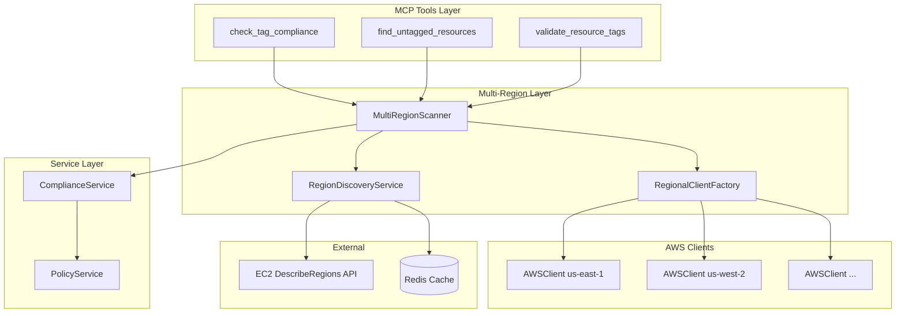
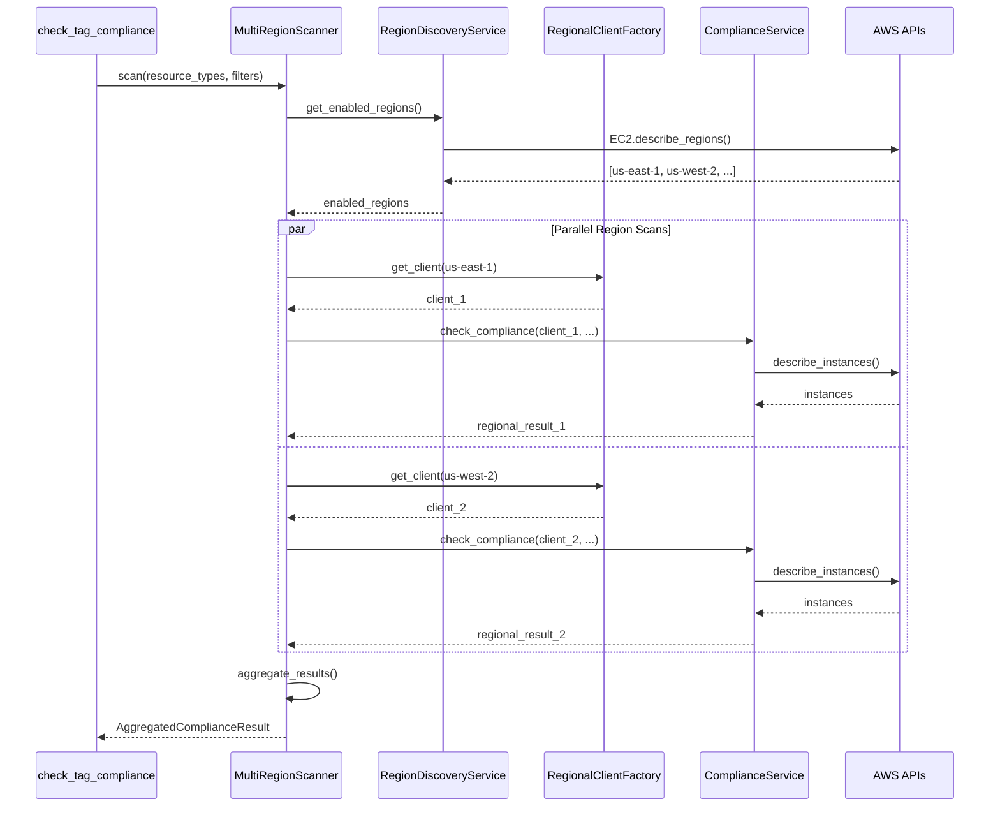

# Design Document: Multi-Region Scanning

## Overview

This design extends the FinOps Tag Compliance MCP Server to scan AWS resources across all enabled regions in an AWS account. The current implementation is limited to a single region configured via the `AWS_REGION` environment variable. This enhancement enables complete visibility into tag compliance across an organization's entire AWS footprint.

The design introduces three new components:
1. **RegionDiscoveryService** - Discovers and caches enabled AWS regions
2. **RegionalClientFactory** - Creates and manages AWS clients for multiple regions
3. **MultiRegionScanner** - Orchestrates parallel scanning across regions and aggregates results

The implementation prioritizes:
- **Parallel execution** for performance (scanning 20+ regions sequentially would be too slow)
- **Graceful degradation** when regions fail or are disabled
- **Efficient caching** to minimize API costs
- **Backward compatibility** with existing single-region behavior

## Architecture



### Scan Flow Sequence



## Components and Interfaces

### RegionDiscoveryService

Discovers all enabled AWS regions for the account using the EC2 DescribeRegions API.

```python
class RegionDiscoveryService:
    """
    Discovers and caches enabled AWS regions.
    
    Uses EC2 DescribeRegions API to find all regions that are enabled
    for the account. Results are cached to minimize API calls.
    """
    
    def __init__(
        self,
        ec2_client: boto3.client,
        cache: RedisCache,
        cache_ttl: int = 3600  # 1 hour default
    ):
        """Initialize with EC2 client and cache."""
        pass
    
    async def get_enabled_regions(self) -> list[str]:
        """
        Get list of all enabled AWS regions.
        
        Returns cached results if available and fresh.
        Falls back to default region on API failure.
        
        Returns:
            List of region codes (e.g., ["us-east-1", "us-west-2", ...])
        """
        pass
    
    async def invalidate_cache(self) -> bool:
        """Invalidate the cached region list."""
        pass
```

### RegionalClientFactory

Creates and manages AWS clients for different regions efficiently.

```python
class RegionalClientFactory:
    """
    Factory for creating and caching regional AWS clients.
    
    Reuses clients within a session to avoid repeated initialization.
    Applies consistent boto3 configuration across all clients.
    """
    
    def __init__(
        self,
        default_region: str = "us-east-1",
        boto_config: Config | None = None
    ):
        """Initialize with default region and boto3 config."""
        pass
    
    def get_client(self, region: str) -> AWSClient:
        """
        Get or create an AWS client for the specified region.
        
        Reuses existing clients for the same region.
        
        Args:
            region: AWS region code
            
        Returns:
            AWSClient configured for the specified region
        """
        pass
    
    def clear_clients(self) -> None:
        """Clear all cached clients (for testing/cleanup)."""
        pass
```

### MultiRegionScanner

Orchestrates parallel scanning across regions and aggregates results.

```python
class MultiRegionScanner:
    """
    Orchestrates multi-region resource scanning.
    
    Scans resources across all enabled regions in parallel,
    handles failures gracefully, and aggregates results.
    """
    
    def __init__(
        self,
        region_discovery: RegionDiscoveryService,
        client_factory: RegionalClientFactory,
        compliance_service_factory: Callable[[AWSClient], ComplianceService],
        max_concurrent_regions: int = 5,
        region_timeout_seconds: int = 60
    ):
        """Initialize with dependencies and configuration."""
        pass
    
    async def scan_all_regions(
        self,
        resource_types: list[str],
        filters: dict | None = None,
        severity: str = "all"
    ) -> MultiRegionComplianceResult:
        """
        Scan resources across all enabled regions.
        
        Executes region scans in parallel with configurable concurrency.
        Aggregates results and handles partial failures.
        
        Args:
            resource_types: Resource types to scan
            filters: Optional filters (may include region filter)
            severity: Severity filter for violations
            
        Returns:
            Aggregated compliance result from all regions
        """
        pass
    
    async def _scan_region(
        self,
        region: str,
        resource_types: list[str],
        filters: dict | None,
        severity: str
    ) -> RegionalScanResult:
        """
        Scan a single region with retry logic.
        
        Returns result or error information on failure.
        """
        pass
    
    def _aggregate_results(
        self,
        regional_results: list[RegionalScanResult]
    ) -> MultiRegionComplianceResult:
        """
        Aggregate results from multiple regions.
        
        Combines resources, violations, and calculates overall score.
        """
        pass
    
    def _is_global_resource_type(self, resource_type: str) -> bool:
        """Check if a resource type is global (not region-specific)."""
        pass
```

### Updated ComplianceService Interface

The existing ComplianceService needs minor updates to accept an AWS client parameter.

```python
class ComplianceService:
    """Updated to support injected AWS client for multi-region scanning."""
    
    def __init__(
        self,
        cache: RedisCache,
        aws_client: AWSClient,  # Now required, not created internally
        policy_service: PolicyService,
        cache_ttl: int = 3600
    ):
        pass
```

## Data Models

### MultiRegionComplianceResult

```python
from pydantic import BaseModel, Field
from datetime import datetime

class RegionalScanResult(BaseModel):
    """Result from scanning a single region."""
    
    region: str = Field(..., description="AWS region code")
    success: bool = Field(..., description="Whether the scan succeeded")
    resources: list[dict] = Field(default_factory=list, description="Resources found")
    violations: list[Violation] = Field(default_factory=list, description="Violations found")
    compliant_count: int = Field(default=0, description="Number of compliant resources")
    error_message: str | None = Field(default=None, description="Error if scan failed")
    scan_duration_ms: int = Field(default=0, description="Scan duration in milliseconds")


class RegionScanMetadata(BaseModel):
    """Metadata about which regions were scanned."""
    
    total_regions: int = Field(..., description="Total regions attempted")
    successful_regions: list[str] = Field(default_factory=list, description="Regions scanned successfully")
    failed_regions: list[str] = Field(default_factory=list, description="Regions that failed to scan")
    skipped_regions: list[str] = Field(default_factory=list, description="Regions skipped (disabled/filtered)")


class MultiRegionComplianceResult(BaseModel):
    """Aggregated compliance result from multi-region scanning."""
    
    compliance_score: float = Field(..., ge=0.0, le=1.0, description="Overall compliance score")
    total_resources: int = Field(..., ge=0, description="Total resources across all regions")
    compliant_resources: int = Field(..., ge=0, description="Compliant resources across all regions")
    violations: list[Violation] = Field(default_factory=list, description="All violations")
    cost_attribution_gap: float = Field(default=0.0, ge=0.0, description="Total cost gap")
    scan_timestamp: datetime = Field(default_factory=datetime.utcnow)
    
    # Multi-region specific fields
    region_metadata: RegionScanMetadata = Field(..., description="Region scan metadata")
    regional_breakdown: dict[str, RegionalSummary] = Field(
        default_factory=dict,
        description="Per-region compliance summary"
    )


class RegionalSummary(BaseModel):
    """Summary of compliance for a single region."""
    
    region: str
    total_resources: int
    compliant_resources: int
    compliance_score: float
    violation_count: int
    cost_attribution_gap: float
```

### Configuration Model Updates

```python
class MultiRegionSettings(BaseModel):
    """Configuration for multi-region scanning."""
    
    multi_region_enabled: bool = Field(
        default=True,
        description="Enable multi-region scanning"
    )
    max_concurrent_regions: int = Field(
        default=5,
        ge=1,
        le=20,
        description="Maximum regions to scan in parallel"
    )
    region_scan_timeout_seconds: int = Field(
        default=60,
        ge=10,
        le=300,
        description="Timeout for scanning a single region"
    )
    region_cache_ttl_seconds: int = Field(
        default=3600,
        ge=60,
        description="TTL for caching enabled regions list"
    )
```

### Global Resource Types

```python
# Resource types that are global (not region-specific)
GLOBAL_RESOURCE_TYPES = frozenset([
    "s3:bucket",           # S3 buckets are global
    "iam:role",            # IAM is global
    "iam:user",            # IAM is global
    "iam:policy",          # IAM is global
    "route53:hostedzone",  # Route 53 is global
    "cloudfront:distribution",  # CloudFront is global
])

# Resource types that are regional
REGIONAL_RESOURCE_TYPES = frozenset([
    "ec2:instance",
    "ec2:volume",
    "ec2:snapshot",
    "ec2:elastic-ip",
    "ec2:natgateway",
    "rds:db",
    "lambda:function",
    "ecs:service",
    "ecs:cluster",
    "eks:cluster",
    "opensearch:domain",
    "dynamodb:table",
    "elasticache:cluster",
    "sqs:queue",
    "sns:topic",
    "kinesis:stream",
    # ... and more
])
```


## Correctness Properties

*A property is a characteristic or behavior that should hold true across all valid executions of a system—essentially, a formal statement about what the system should do. Properties serve as the bridge between human-readable specifications and machine-verifiable correctness guarantees.*

### Property 1: Region Filtering by Opt-In Status

*For any* list of regions returned by the EC2 DescribeRegions API, the Region_Discovery_Service SHALL return only regions where `OptInStatus` is "opt-in-not-required" or "opted-in", excluding all regions with "not-opted-in" status.

**Validates: Requirements 1.2**

### Property 2: Client Reuse Idempotence

*For any* region code, calling `get_client(region)` multiple times on the same RegionalClientFactory instance SHALL return the same AWSClient instance (object identity).

**Validates: Requirements 2.2**

### Property 3: All Enabled Regions Are Scanned

*For any* set of enabled regions and any regional resource type, when multi-region scanning is enabled and no region filter is provided, the MultiRegionScanner SHALL attempt to scan each enabled region exactly once.

**Validates: Requirements 2.1, 3.1, 6.4**

### Property 4: Empty Results Are Successful

*For any* region that returns zero resources during a scan, the RegionalScanResult SHALL have `success=True` and `error_message=None`, with an empty resources list.

**Validates: Requirements 3.3**

### Property 5: Partial Failures Don't Stop Scanning

*For any* set of regions where some scans succeed and some fail, the MultiRegionComplianceResult SHALL contain resources from all successful regions, and the `region_metadata.failed_regions` list SHALL contain exactly the regions that failed.

**Validates: Requirements 3.5, 4.5**

### Property 6: Resource Aggregation Preserves Region

*For any* set of regional scan results, the aggregated result SHALL contain all resources from all successful regions, and each resource SHALL have a `region` attribute matching the region it was scanned from.

**Validates: Requirements 4.1, 4.2**

### Property 7: Compliance Score Calculation

*For any* set of regional scan results with known compliant and total resource counts, the aggregated compliance score SHALL equal `sum(compliant_resources) / sum(total_resources)` across all successful regions. When total resources is zero, the score SHALL be 1.0.

**Validates: Requirements 4.3**

### Property 8: Cost Gap Summation

*For any* set of regional scan results with cost attribution gaps, the aggregated `cost_attribution_gap` SHALL equal the sum of all regional cost gaps.

**Validates: Requirements 4.4**

### Property 9: Global Resource Type Identification

*For any* resource type string, the `_is_global_resource_type()` method SHALL return `True` if and only if the resource type is in the GLOBAL_RESOURCE_TYPES set.

**Validates: Requirements 5.2**

### Property 10: Global Resources Appear Exactly Once

*For any* global resource type (e.g., S3 buckets), when scanning across multiple regions, the aggregated result SHALL contain each unique resource exactly once, regardless of how many regions were scanned.

**Validates: Requirements 5.1, 5.3**

### Property 11: Region Filter Application

*For any* region filter provided in the request, the MultiRegionScanner SHALL scan only the regions specified in the filter, and the `region_metadata.successful_regions` SHALL be a subset of the filter.

**Validates: Requirements 6.1**

### Property 12: Multi-Region Disabled Mode

*For any* scan request when `MULTI_REGION_ENABLED=False`, the MultiRegionScanner SHALL scan only the default configured region, and `region_metadata.total_regions` SHALL equal 1.

**Validates: Requirements 7.1, 7.4**

### Property 13: Cache Key Determinism

*For any* two scan requests with the same resource types, filters, and severity, the generated cache key SHALL be identical. For requests with different parameters, the cache keys SHALL be different.

**Validates: Requirements 8.2**

## Error Handling

### Region Discovery Errors

| Error Scenario | Handling Strategy |
|----------------|-------------------|
| EC2 DescribeRegions API failure | Fall back to default region only, log warning |
| Timeout on region discovery | Use cached regions if available, else default region |
| Invalid credentials | Propagate error to caller with clear message |

### Regional Scan Errors

| Error Scenario | Handling Strategy |
|----------------|-------------------|
| Region access denied | Mark region as failed, continue with others |
| Throttling/rate limit | Retry with exponential backoff (max 3 retries) |
| Timeout on region scan | Mark region as failed after timeout, continue |
| Empty results | Treat as success with zero resources |
| Disabled region in filter | Return error indicating invalid region |

### Aggregation Errors

| Error Scenario | Handling Strategy |
|----------------|-------------------|
| All regions failed | Return error with list of failed regions |
| Partial failures | Return partial results with failure metadata |
| Inconsistent data | Log warning, use best-effort aggregation |

### Error Response Format

```python
class MultiRegionScanError(Exception):
    """Error during multi-region scanning."""
    
    def __init__(
        self,
        message: str,
        failed_regions: list[str],
        partial_results: MultiRegionComplianceResult | None = None
    ):
        super().__init__(message)
        self.failed_regions = failed_regions
        self.partial_results = partial_results
```

## Testing Strategy

### Unit Tests

Unit tests focus on individual component logic with mocked dependencies:

1. **RegionDiscoveryService**
   - Test filtering of disabled regions
   - Test caching behavior (hit/miss)
   - Test fallback on API failure

2. **RegionalClientFactory**
   - Test client creation for new regions
   - Test client reuse for same region
   - Test configuration consistency

3. **MultiRegionScanner**
   - Test aggregation logic with mock results
   - Test global resource deduplication
   - Test region filter application
   - Test disabled mode behavior

4. **Cache Key Generation**
   - Test deterministic key generation
   - Test different parameters produce different keys

### Property-Based Tests

Property tests use Hypothesis to verify universal properties with generated inputs:

| Property | Generator Strategy |
|----------|-------------------|
| Property 1: Region filtering | Generate lists of regions with random opt-in statuses |
| Property 2: Client reuse | Generate random region codes, call get_client multiple times |
| Property 3: All regions scanned | Generate sets of enabled regions, verify all attempted |
| Property 4: Empty results | Generate empty resource lists, verify success status |
| Property 5: Partial failures | Generate mixed success/failure results, verify aggregation |
| Property 6: Region preservation | Generate regional results with resources, verify region attribute |
| Property 7: Score calculation | Generate results with known counts, verify formula |
| Property 8: Cost summation | Generate results with random costs, verify sum |
| Property 9: Global type ID | Generate resource type strings, verify classification |
| Property 10: Global deduplication | Generate global resources across regions, verify uniqueness |
| Property 11: Filter application | Generate region filters, verify only filtered regions scanned |
| Property 12: Disabled mode | Generate requests with disabled config, verify single region |
| Property 13: Cache key determinism | Generate identical/different params, verify key behavior |

### Integration Tests

Integration tests verify end-to-end flows with mocked AWS APIs:

1. **Full multi-region scan flow**
   - Mock EC2 DescribeRegions to return multiple regions
   - Mock regional resource APIs
   - Verify aggregated results

2. **Partial failure handling**
   - Mock some regions to fail
   - Verify partial results returned

3. **Cache integration**
   - Verify results are cached
   - Verify cache bypass with force_refresh

### Test Configuration

```python
# Property test configuration
PROPERTY_TEST_ITERATIONS = 100

# Test regions for mocking
TEST_REGIONS = ["us-east-1", "us-west-2", "eu-west-1", "ap-southeast-1"]

# Hypothesis settings
settings(
    max_examples=100,
    deadline=timedelta(seconds=10),
    suppress_health_check=[HealthCheck.too_slow]
)
```
