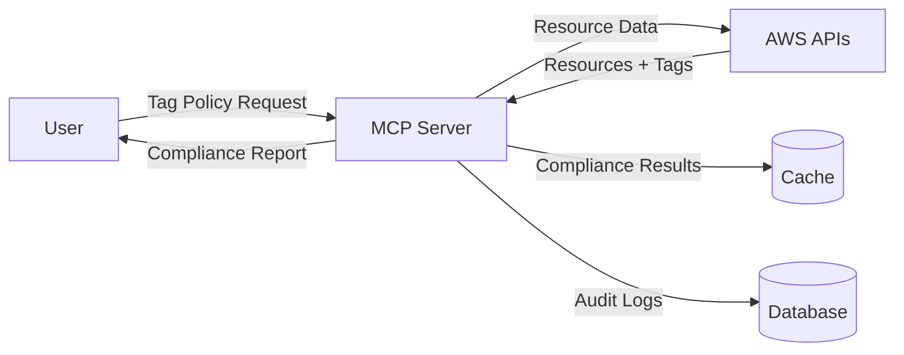
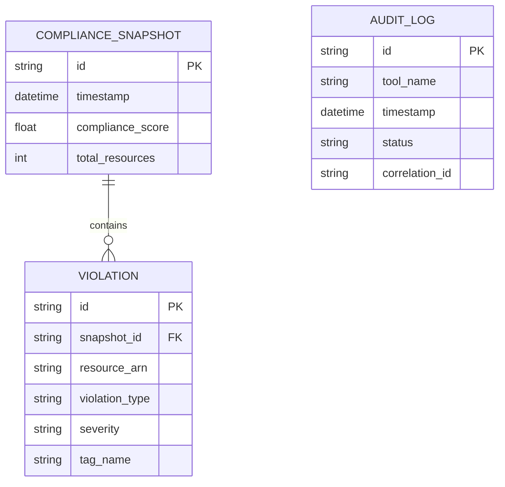
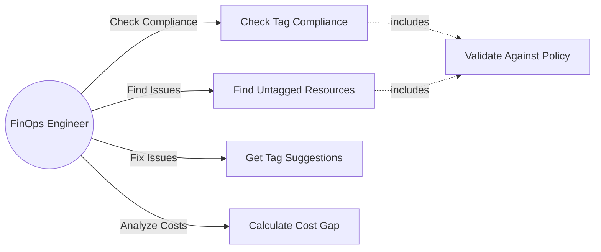
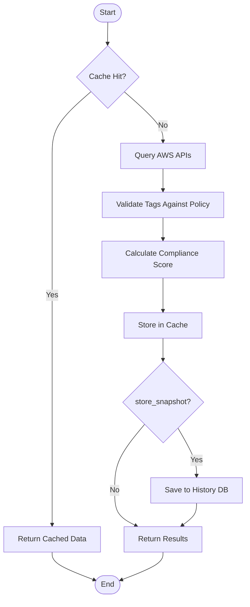
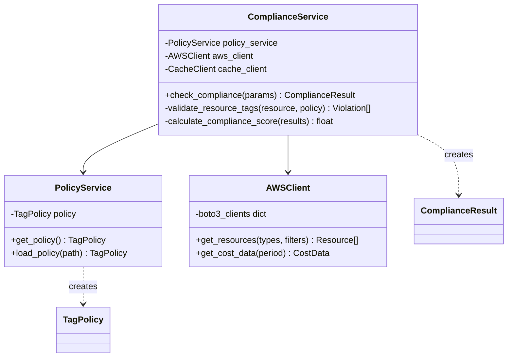

# System Engineering Diagram Best Practices

## Overview

This document outlines best practices for creating effective system engineering diagrams and explains when to use different diagram types.

## Essential Diagram Types for System Engineering

### 1. Architecture Diagrams

**Purpose**: Show the high-level structure of the system, major components, and their relationships.

**When to Use**:
- Documenting overall system structure
- Communicating with stakeholders
- Onboarding new team members
- Planning system changes

**Best Practices**:
- Use consistent visual hierarchy (layers, groupings)
- Show clear boundaries between subsystems
- Include external dependencies
- Use color coding for different component types
- Keep it high-level (avoid implementation details)

**Example**: `01-system-architecture.md` in this repository

### 2. State Machine Diagrams

**Purpose**: Model the different states an entity can be in and the transitions between states.

**When to Use**:
- Modeling workflow states (e.g., order processing, request lifecycle)
- Documenting business processes
- Designing stateful systems
- Validating state transitions
- Error handling flows

**Best Practices**:
- Clearly label all states with meaningful names
- Show all possible transitions (including error paths)
- Include guard conditions for transitions
- Document entry/exit actions
- Show initial and final states
- Keep related states grouped visually

**Example**: `02-state-machine-diagrams.md` in this repository

### 3. Sequence Diagrams

**Purpose**: Show how components interact over time in a specific scenario.

**When to Use**:
- Documenting API workflows
- Explaining complex interactions
- Debugging timing issues
- Designing distributed systems
- Planning service integration

**Best Practices**:
- Order participants left-to-right by call hierarchy
- Use clear, descriptive message labels
- Show async vs sync calls differently
- Include error scenarios (alt blocks)
- Add timing annotations for performance-critical paths
- Use notes for important clarifications
- Keep scenarios focused (one per diagram)

**Example**: `03-sequence-diagrams.md` in this repository

### 4. Component Diagrams

**Purpose**: Show logical components and their dependencies.

**When to Use**:
- Documenting software architecture
- Planning modularization
- Analyzing dependencies
- Refactoring discussions
- Code structure documentation

**Best Practices**:
- Show interfaces between components
- Use dependency arrows consistently
- Group related components
- Show layers/tiers clearly
- Include key technologies/frameworks
- Document component responsibilities

**Example**: `04-component-diagram.md` in this repository

### 5. Deployment Diagrams

**Purpose**: Show physical deployment of software on hardware/infrastructure.

**When to Use**:
- Infrastructure planning
- DevOps documentation
- Capacity planning
- Disaster recovery planning
- Security architecture

**Best Practices**:
- Show all deployment nodes (servers, containers, etc.)
- Include network topology
- Document scaling strategy
- Show monitoring/logging infrastructure
- Include security boundaries
- Annotate with resource requirements

**Example**: `05-deployment-architecture.md` in this repository

## Additional Important Diagram Types

### 6. Data Flow Diagrams (DFD)

**Purpose**: Show how data moves through the system.

**When to Use**:
- Analyzing data processing pipelines
- Documenting ETL processes
- Security analysis (data flow)
- Compliance documentation
- Understanding data transformations

**Levels**:
- **Level 0 (Context)**: System as single process with external entities
- **Level 1**: Major processes and data stores
- **Level 2+**: Detailed process decomposition

**Best Practices**:
- Use standard notation (circles=processes, rectangles=external entities, parallel lines=data stores)
- Label all data flows with data names
- Number processes consistently
- Keep each level at consistent abstraction
- Don't mix different levels in one diagram

**Example DFD**:


### 7. Entity Relationship Diagrams (ERD)

**Purpose**: Model data entities and their relationships.

**When to Use**:
- Database design
- Data modeling
- Understanding data dependencies
- Migration planning
- API design (for data-centric APIs)

**Best Practices**:
- Use crow's foot notation for cardinality
- Show all key attributes
- Normalize appropriately
- Include relationship names
- Document constraints
- Use consistent naming conventions

**Example ERD**:


### 8. Use Case Diagrams

**Purpose**: Show system functionality from user perspective.

**When to Use**:
- Requirements gathering
- Scope definition
- User story mapping
- Feature planning
- Stakeholder communication

**Best Practices**:
- Focus on user goals, not system functions
- Show actors (users, external systems)
- Group related use cases
- Show relationships (includes, extends)
- Keep use case names action-oriented
- Don't include implementation details

**Example Use Case**:


### 9. Activity Diagrams

**Purpose**: Show workflow or business process flows.

**When to Use**:
- Documenting algorithms
- Business process modeling
- Workflow design
- Decision logic documentation
- Parallel process flows

**Best Practices**:
- Use swimlanes for different actors/systems
- Show decision points clearly
- Include parallel flows (fork/join)
- Label transitions with conditions
- Show start and end points
- Keep readable (split complex flows)

**Example Activity Diagram**:


### 10. Class Diagrams (for OOP systems)

**Purpose**: Show classes, attributes, methods, and relationships.

**When to Use**:
- Object-oriented design
- API design documentation
- Code generation
- Understanding inheritance hierarchies
- Refactoring planning

**Best Practices**:
- Show visibility (public, private, protected)
- Include key attributes and methods
- Show relationships (inheritance, composition, aggregation)
- Use interfaces appropriately
- Don't show every method (focus on public API)
- Group related classes

**Example Class Diagram**:


### 11. Network Diagrams

**Purpose**: Show network topology, connections, and security zones.

**When to Use**:
- Network architecture documentation
- Security planning
- Troubleshooting connectivity issues
- Disaster recovery planning
- Capacity planning

**Best Practices**:
- Show all network devices (routers, switches, firewalls)
- Include IP addressing scheme
- Document security zones
- Show network protocols
- Include bandwidth/latency requirements
- Document redundancy

### 12. Infrastructure Diagrams

**Purpose**: Show cloud infrastructure resources and their relationships.

**When to Use**:
- Cloud architecture documentation
- Infrastructure as Code (IaC) planning
- Cost optimization
- Security reviews
- Compliance documentation

**Best Practices**:
- Use official cloud provider icons
- Show regions/availability zones
- Document scaling policies
- Include monitoring/alerting
- Show data replication
- Annotate with costs

### 13. C4 Model Diagrams

**Purpose**: Hierarchical set of diagrams at different abstraction levels.

**Levels**:
1. **Context**: System in environment with users and dependencies
2. **Container**: High-level technology choices
3. **Component**: Components within containers
4. **Code**: Class diagrams (optional)

**When to Use**:
- Comprehensive architecture documentation
- Progressive disclosure of complexity
- Stakeholder communication at different levels

**Best Practices**:
- Start with context, drill down as needed
- Use consistent notation across levels
- Keep each level focused
- Link diagrams together
- Update all levels when architecture changes

## Diagram Selection Matrix

| Goal | Primary Diagram | Secondary Diagrams |
|------|----------------|-------------------|
| **Show system structure** | Architecture Diagram | Component Diagram, C4 Model |
| **Document workflows** | Sequence Diagram | Activity Diagram, State Machine |
| **Model business processes** | Activity Diagram | Use Case Diagram, State Machine |
| **Design database** | ERD | Data Flow Diagram |
| **Plan infrastructure** | Deployment Diagram | Network Diagram, Infrastructure Diagram |
| **Explain interactions** | Sequence Diagram | Component Diagram |
| **Document states** | State Machine Diagram | Activity Diagram |
| **Show data flow** | Data Flow Diagram | Sequence Diagram |
| **Model classes** | Class Diagram | Component Diagram |
| **Document requirements** | Use Case Diagram | Activity Diagram |

## General Best Practices

### 1. Clarity Over Completeness
- Don't try to show everything in one diagram
- Create multiple focused diagrams instead of one complex one
- Use the right level of abstraction for your audience

### 2. Consistency
- Use consistent notation within a project
- Follow industry standards (UML, C4, etc.)
- Use consistent naming conventions
- Maintain consistent visual style

### 3. Audience Awareness
- Technical diagrams for developers (components, classes)
- High-level diagrams for executives (context, deployment)
- Process diagrams for business analysts (use cases, activity)

### 4. Maintainability
- Use text-based formats when possible (Mermaid, PlantUML)
- Store diagrams in version control
- Update diagrams when architecture changes
- Add generation date and version numbers

### 5. Documentation
- Add legends explaining symbols and colors
- Include notes for clarifications
- Document assumptions
- Link diagrams to related documentation

### 6. Visual Design
- Use color purposefully (not just decoration)
- Ensure adequate contrast
- Use whitespace effectively
- Align elements properly
- Use consistent shapes for similar elements

### 7. Tooling
**Recommended Tools**:
- **Text-based**: Mermaid (used in this project), PlantUML, Graphviz
- **Visual**: Lucidchart, Draw.io, Excalidraw
- **Enterprise**: Enterprise Architect, Sparx Systems
- **Cloud-specific**: AWS Architecture Icons, Azure Icons, GCP Icons

### 8. Living Documentation
- Diagrams should evolve with the system
- Automate diagram generation where possible
- Review diagrams during architecture reviews
- Link diagrams to code (architecture decision records)

## Anti-Patterns to Avoid

### 1. The "Everything Diagram"
❌ **Problem**: One massive diagram trying to show all aspects
✅ **Solution**: Create multiple focused diagrams, each with clear purpose

### 2. Outdated Diagrams
❌ **Problem**: Diagrams don't reflect current system state
✅ **Solution**: Update diagrams as part of development process, use automated generation

### 3. Implementation Details in High-Level Diagrams
❌ **Problem**: Showing code-level details in architecture diagrams
✅ **Solution**: Use appropriate abstraction level for diagram type

### 4. Inconsistent Notation
❌ **Problem**: Using different symbols for same concepts across diagrams
✅ **Solution**: Establish and document notation standards

### 5. No Legend or Key
❌ **Problem**: Unclear what symbols, colors, or shapes mean
✅ **Solution**: Always include legend for custom notation

### 6. Too Many Colors
❌ **Problem**: Rainbow diagrams with no semantic meaning
✅ **Solution**: Use 3-5 colors purposefully (e.g., layers, component types)

### 7. Crossing Lines
❌ **Problem**: Many crossing arrows making diagram hard to follow
✅ **Solution**: Rearrange components, use layering, split into multiple diagrams

## Diagram Checklist

Before finalizing a diagram, verify:

- [ ] **Purpose is clear**: Can viewer understand the goal?
- [ ] **Audience appropriate**: Right level of detail?
- [ ] **Notation consistent**: Following established conventions?
- [ ] **Labels clear**: All elements properly labeled?
- [ ] **Legend included**: Custom notation explained?
- [ ] **Current**: Reflects actual system state?
- [ ] **Readable**: Not too cluttered or complex?
- [ ] **Version controlled**: Stored in repo with code?
- [ ] **Linked to docs**: Referenced from relevant documentation?
- [ ] **Dated**: Includes creation/update date?

## Example Documentation Structure

```
docs/
├── architecture/
│   ├── 00-overview.md              (high-level introduction)
│   ├── 01-system-context.md        (C4 Level 1)
│   ├── 02-containers.md            (C4 Level 2)
│   └── decisions/                  (ADRs)
├── diagrams/
│   ├── 00-diagram-best-practices.md
│   ├── 01-system-architecture.md
│   ├── 02-state-machine-diagrams.md
│   ├── 03-sequence-diagrams.md
│   ├── 04-component-diagram.md
│   └── 05-deployment-architecture.md
├── api/
│   ├── api-reference.md
│   └── sequence-diagrams/          (API-specific sequences)
├── deployment/
│   ├── docker-compose.yml
│   ├── kubernetes/
│   └── terraform/
└── runbooks/
    ├── incident-response.md
    └── operations.md
```

## Resources

### Standards and Notations
- **UML**: Unified Modeling Language (industry standard)
- **C4 Model**: Context, Containers, Components, Code
- **ArchiMate**: Enterprise architecture modeling
- **BPMN**: Business Process Model and Notation

### Learning Resources
- [C4 Model](https://c4model.com/)
- [UML Specification](https://www.omg.org/spec/UML/)
- [Mermaid Documentation](https://mermaid.js.org/)
- [Software Architecture Guide](https://martinfowler.com/architecture/)

### Tools
- [Mermaid Live Editor](https://mermaid.live/)
- [Draw.io](https://app.diagrams.net/)
- [PlantUML](https://plantuml.com/)
- [Excalidraw](https://excalidraw.com/)

## Conclusion

Good diagrams are essential for:
- **Communication**: Between team members and stakeholders
- **Documentation**: Preserving architectural knowledge
- **Analysis**: Understanding system complexity
- **Planning**: Designing changes and new features
- **Onboarding**: Helping new team members understand the system

Invest time in creating and maintaining quality diagrams - they will pay dividends throughout the system's lifetime.
