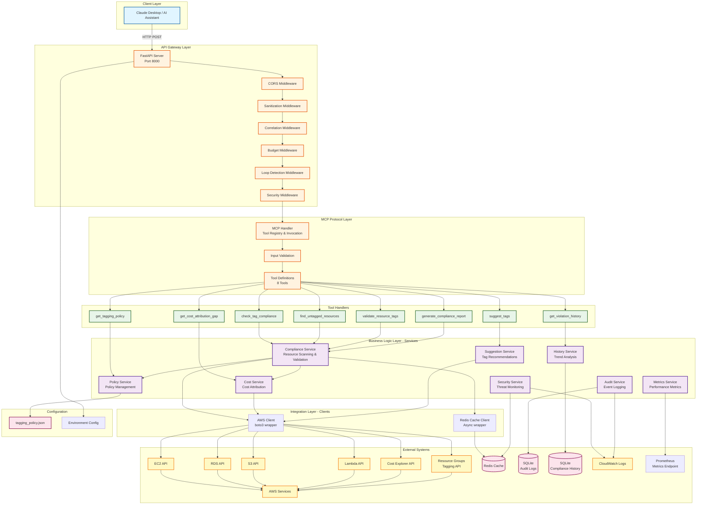

# System Architecture Diagram

## Overview
This diagram shows the high-level architecture of the FinOps Tag Compliance MCP Server, including all major components, data stores, and external integrations.

## Key Components

### 1. Client Layer
- **Claude Desktop**: AI assistant that invokes MCP tools via HTTP

### 2. API Gateway Layer
- **FastAPI Server**: HTTP server exposing MCP protocol endpoints
- **Middleware Stack**: CORS, sanitization, correlation, budget, loop detection, security

### 3. MCP Protocol Layer
- **MCP Handler**: Manages tool registry and invocation
- **Tool Definitions**: Defines 8 available tools with schemas
- **Input Validation**: Validates all tool inputs

### 4. Business Logic Layer
8 core services handling different aspects:
- Compliance checking and validation
- Policy management
- Audit logging
- Historical trend analysis
- Cost attribution calculation
- Tag suggestion generation
- Security monitoring
- Metrics aggregation

### 5. Tool Handlers
8 MCP tools that map to service functions

### 6. Integration Layer
- **AWS Client**: Wrapper around boto3 with rate limiting
- **Redis Cache Client**: Async cache interface

### 7. External Systems
- **AWS Services**: EC2, RDS, S3, Lambda, Cost Explorer, Resource Groups
- **Data Stores**: Redis (cache), SQLite (audit & history)
- **Observability**: CloudWatch Logs, Prometheus metrics

### 8. Configuration
- **tagging_policy.json**: Defines required and optional tags
- **Environment Config**: Runtime configuration from env vars

## Data Flow Patterns

1. **Synchronous Flow**: Client → FastAPI → MCP Handler → Tool → Service → AWS → Response
2. **Caching Flow**: Service checks Redis before calling AWS
3. **Audit Flow**: All tool invocations logged to SQLite
4. **Security Flow**: Security events logged to CloudWatch and tracked in Redis
5. **Metrics Flow**: Performance metrics aggregated and exposed via Prometheus endpoint
