# System architecture diagram

## Overview

This diagram shows the high-level architecture of the FinOps Tag Compliance MCP Server running via stdio transport (the standard mode for Claude Desktop and MCP Inspector).

```mermaid
graph TB
    subgraph "Client layer"
        Client[Claude Desktop / MCP Inspector]
    end

    subgraph "MCP transport layer"
        FastMCP[FastMCP stdio server<br/>stdin/stdout JSON-RPC]
    end

    subgraph "Tool handlers (14 tools)"
        T1[check_tag_compliance]
        T2[find_untagged_resources]
        T3[validate_resource_tags]
        T4[get_cost_attribution_gap]
        T5[suggest_tags]
        T6[get_tagging_policy]
        T7[generate_compliance_report]
        T8[get_violation_history]
        T9[generate_custodian_policy]
        T10[generate_openops_workflow]
        T11[schedule_compliance_audit]
        T12[detect_tag_drift]
        T13[export_violations_csv]
        T14[import_aws_tag_policy]
    end

    subgraph "Service container"
        subgraph "Business logic layer — services"
            ComplianceService[Compliance Service<br/>Resource scanning and validation]
            PolicyService[Policy Service<br/>Policy management]
            CostService[Cost Service<br/>Cost attribution]
            SuggestionService[Suggestion Service<br/>Tag recommendations]
            AuditService[Audit Service<br/>Event logging]
            HistoryService[History Service<br/>Trend analysis]
            AutoPolicyService[Auto Policy Service<br/>Policy detection]
            SchedulerService[Scheduler Service<br/>Recurring scans]
        end

        subgraph "Multi-region scanning"
            MultiRegionScanner[Multi-Region Scanner<br/>Parallel region orchestration]
            RegionDiscovery[Region Discovery Service<br/>Discover enabled regions]
            RegionalFactory[Regional Client Factory<br/>Create per-region clients]
        end

        subgraph "Guardrails"
            BudgetTracker[Budget Tracker<br/>100 calls/session limit]
            LoopDetector[Loop Detector<br/>3 identical calls in 5 min]
        end
    end

    subgraph "Integration layer — clients"
        AWSClient[AWS Client<br/>boto3 wrapper with<br/>rate limiting and retries]
        RedisCache[Redis Cache Client<br/>Optional, graceful degradation]
    end

    subgraph "Data layer"
        Redis[(Redis Cache<br/>Optional)]
        AuditDB[(SQLite<br/>Audit logs)]
        HistoryDB[(SQLite<br/>Compliance history)]
        PolicyFile[tagging_policy.json]
        ResourceTypesConfig[resource_types.json]
    end

    subgraph "AWS services"
        EC2[EC2 API]
        RDS[RDS API]
        S3[S3 API]
        Lambda[Lambda API]
        ECS[ECS API]
        OpenSearch[OpenSearch API]
        CostExplorer[Cost Explorer API<br/>Always us-east-1]
        ResourceGroups[Resource Groups<br/>Tagging API]
    end

    %% Client to MCP
    Client -->|stdio JSON-RPC| FastMCP

    %% MCP to Tools
    FastMCP --> T1
    FastMCP --> T2
    FastMCP --> T3
    FastMCP --> T4
    FastMCP --> T5
    FastMCP --> T6
    FastMCP --> T7
    FastMCP --> T8
    FastMCP --> T9
    FastMCP --> T10
    FastMCP --> T11
    FastMCP --> T12
    FastMCP --> T13
    FastMCP --> T14

    %% Tools to Services
    T1 --> ComplianceService
    T2 --> ComplianceService
    T3 --> ComplianceService
    T4 --> CostService
    T5 --> SuggestionService
    T6 --> PolicyService
    T7 --> ComplianceService
    T8 --> HistoryService
    T9 --> PolicyService
    T10 --> PolicyService
    T11 --> PolicyService
    T12 --> ComplianceService
    T13 --> ComplianceService
    T14 --> PolicyService

    %% Multi-region scanning
    T1 --> MultiRegionScanner
    T2 --> MultiRegionScanner
    T3 --> MultiRegionScanner
    T7 --> MultiRegionScanner
    T12 --> MultiRegionScanner
    T13 --> MultiRegionScanner
    MultiRegionScanner --> RegionDiscovery
    MultiRegionScanner --> RegionalFactory
    RegionalFactory --> AWSClient

    %% Services to Clients
    ComplianceService --> AWSClient
    ComplianceService --> RedisCache
    ComplianceService --> PolicyService
    CostService --> AWSClient
    SuggestionService --> AWSClient
    SuggestionService --> PolicyService

    %% Services to Data
    AuditService --> AuditDB
    HistoryService --> HistoryDB
    PolicyService --> PolicyFile
    PolicyService --> ResourceTypesConfig

    %% Clients to External
    AWSClient --> EC2
    AWSClient --> RDS
    AWSClient --> S3
    AWSClient --> Lambda
    AWSClient --> ECS
    AWSClient --> OpenSearch
    AWSClient --> CostExplorer
    AWSClient --> ResourceGroups
    RedisCache --> Redis

    %% Guardrails
    FastMCP -.->|Before each tool call| BudgetTracker
    FastMCP -.->|Before each tool call| LoopDetector
    BudgetTracker -.-> RedisCache
    LoopDetector -.-> RedisCache

    %% Configuration
    RegionDiscovery --> EC2

    %% Styling
    classDef clientStyle fill:#e1f5ff,stroke:#01579b,stroke-width:2px
    classDef mcpStyle fill:#fff3e0,stroke:#e65100,stroke-width:2px
    classDef toolStyle fill:#e8f5e9,stroke:#1b5e20,stroke-width:2px
    classDef serviceStyle fill:#f3e5f5,stroke:#4a148c,stroke-width:2px
    classDef scannerStyle fill:#e8eaf6,stroke:#283593,stroke-width:2px
    classDef guardStyle fill:#fff8e1,stroke:#f9a825,stroke-width:2px
    classDef clientLayerStyle fill:#fff3e0,stroke:#e65100,stroke-width:2px
    classDef dataStyle fill:#fce4ec,stroke:#880e4f,stroke-width:2px
    classDef awsStyle fill:#fff9c4,stroke:#f57f17,stroke-width:2px

    class Client clientStyle
    class FastMCP mcpStyle
    class T1,T2,T3,T4,T5,T6,T7,T8,T9,T10,T11,T12,T13,T14 toolStyle
    class ComplianceService,PolicyService,CostService,SuggestionService,AuditService,HistoryService,AutoPolicyService,SchedulerService serviceStyle
    class MultiRegionScanner,RegionDiscovery,RegionalFactory scannerStyle
    class BudgetTracker,LoopDetector guardStyle
    class AWSClient,RedisCache clientLayerStyle
    class Redis,AuditDB,HistoryDB,PolicyFile,ResourceTypesConfig dataStyle
    class EC2,RDS,S3,Lambda,ECS,OpenSearch,CostExplorer,ResourceGroups awsStyle
```

## Key components

### 1. Client layer
- **Claude Desktop**: AI assistant that invokes MCP tools via stdio
- **MCP Inspector**: Browser-based tool for interactive testing

### 2. MCP transport layer
- **FastMCP stdio server** (`stdio_server.py`): Reads JSON-RPC requests from stdin and writes responses to stdout. Registers all 14 tools via `@mcp.tool()` decorators.

### 3. Tool handlers (14 tools)
Thin adapter functions that translate MCP tool calls into service method calls. Each tool validates inputs, invokes the appropriate service, and formats the result as JSON.

### 4. Service container (`container.py`)
The `ServiceContainer` initializes all services in dependency order and provides dependency injection. It is protocol-agnostic — the same container works for stdio, HTTP, CLI, or any other entry point.

**Core services:**
- **ComplianceService** — Resource scanning, tag validation, compliance score calculation
- **PolicyService** — Loads and validates tagging policy from JSON file
- **CostService** — Cost attribution gap calculations via Cost Explorer
- **SuggestionService** — Pattern-based tag value suggestions
- **AuditService** — SQLite-based audit logging for all tool invocations
- **HistoryService** — SQLite-based compliance scan history and trend tracking
- **AutoPolicyService** — Automatic policy detection from AWS Organizations
- **SchedulerService** — Recurring compliance scans on a schedule

**Multi-region scanning:**
- **MultiRegionScanner** — Orchestrates parallel compliance scans across all enabled AWS regions
- **RegionDiscoveryService** — Queries EC2 to discover enabled regions (cached)
- **RegionalClientFactory** — Creates and caches per-region `AWSClient` instances

**Guardrails:**
- **BudgetTracker** — Enforces per-session tool call limits (default: 100 calls/session)
- **LoopDetector** — Detects repeated identical tool calls (default: 3 identical calls in 5 minutes)

### 5. Integration layer
- **AWSClient** — Wrapper around boto3 with rate limiting (100ms between calls), exponential backoff, and multi-service support
- **RedisCache** — Optional caching layer. Without Redis, the server works fine but doesn't cache results between invocations

### 6. Data layer
- **Redis** (optional) — Compliance scan result cache (default 1-hour TTL)
- **SQLite (audit)** — Audit log of all tool invocations
- **SQLite (history)** — Compliance scan snapshots for trend analysis
- **tagging_policy.json** — Required and optional tag definitions
- **resource_types.json** — Resource type classification (cost-generating vs free)

### 7. AWS services
- **EC2, RDS, S3, Lambda, ECS, OpenSearch** — Individual service APIs for direct resource scanning
- **Resource Groups Tagging API** — Bulk resource discovery (used by "all" mode, returns only tagged resources)
- **Cost Explorer** — Cost data for attribution gap analysis (always `us-east-1`)

## Data flow patterns

1. **Tool invocation**: Client → stdio → FastMCP → Tool → Service → AWS → Response
2. **Caching**: ComplianceService checks Redis before calling AWS APIs
3. **Multi-region**: MultiRegionScanner runs compliance checks in parallel across regions
4. **Audit**: All tool invocations are logged to SQLite
5. **History**: Compliance scan results can be stored as snapshots for trend tracking
6. **Guardrails**: BudgetTracker and LoopDetector checked before each tool execution
