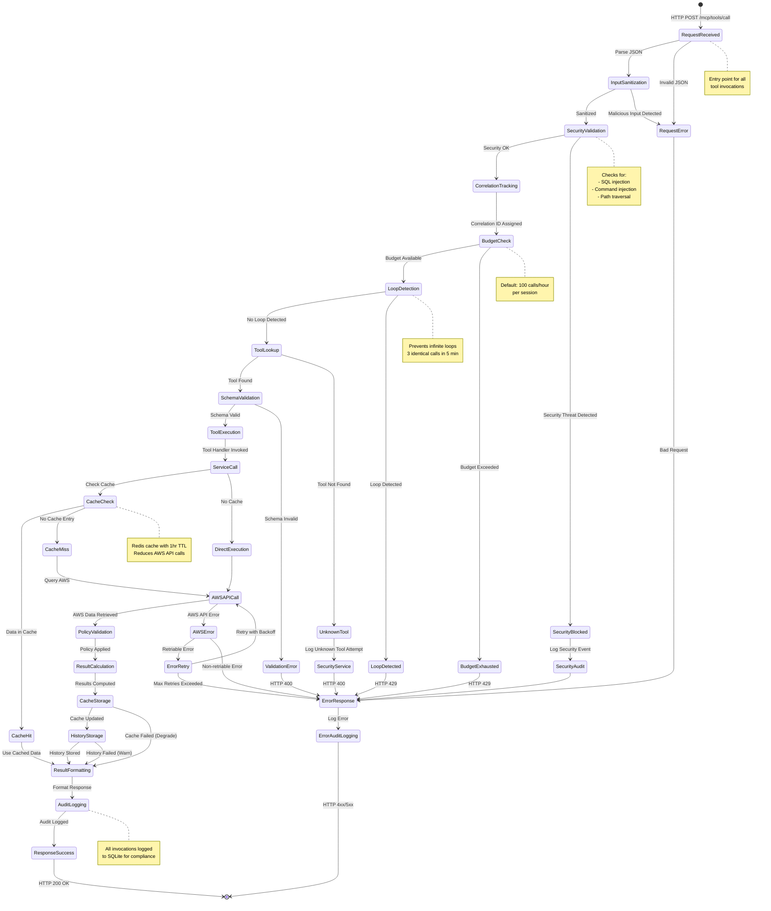
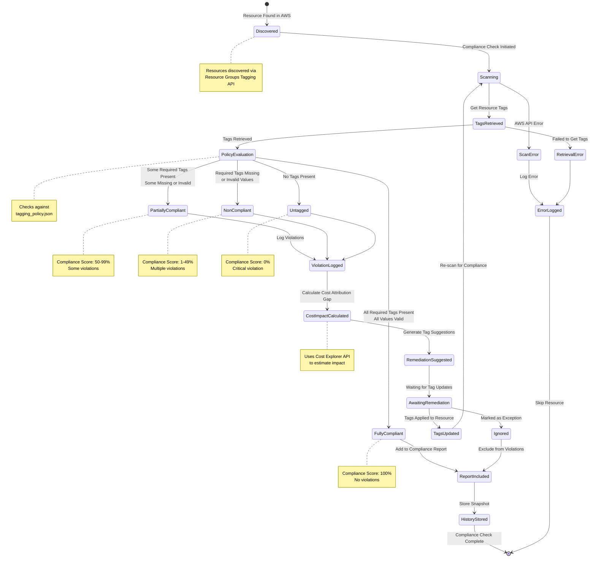
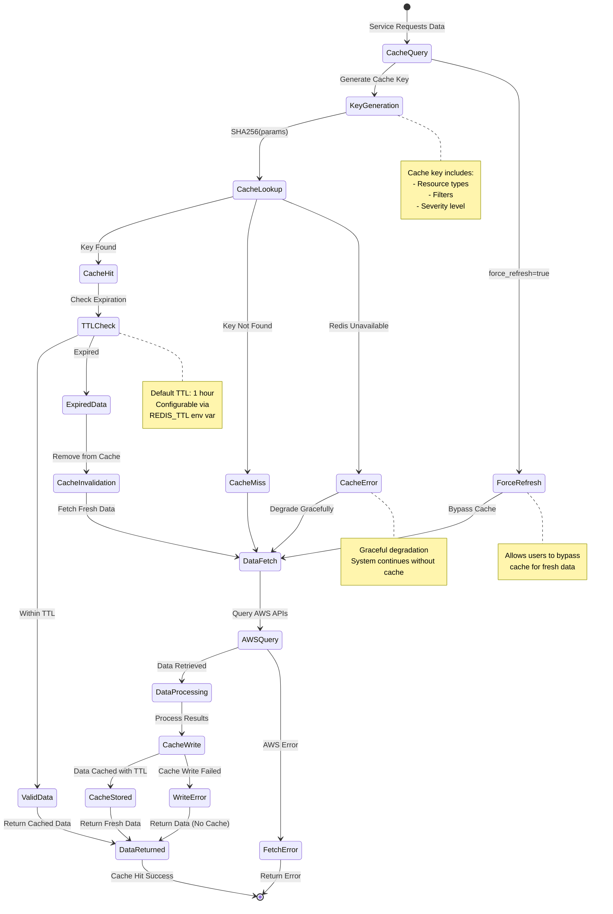
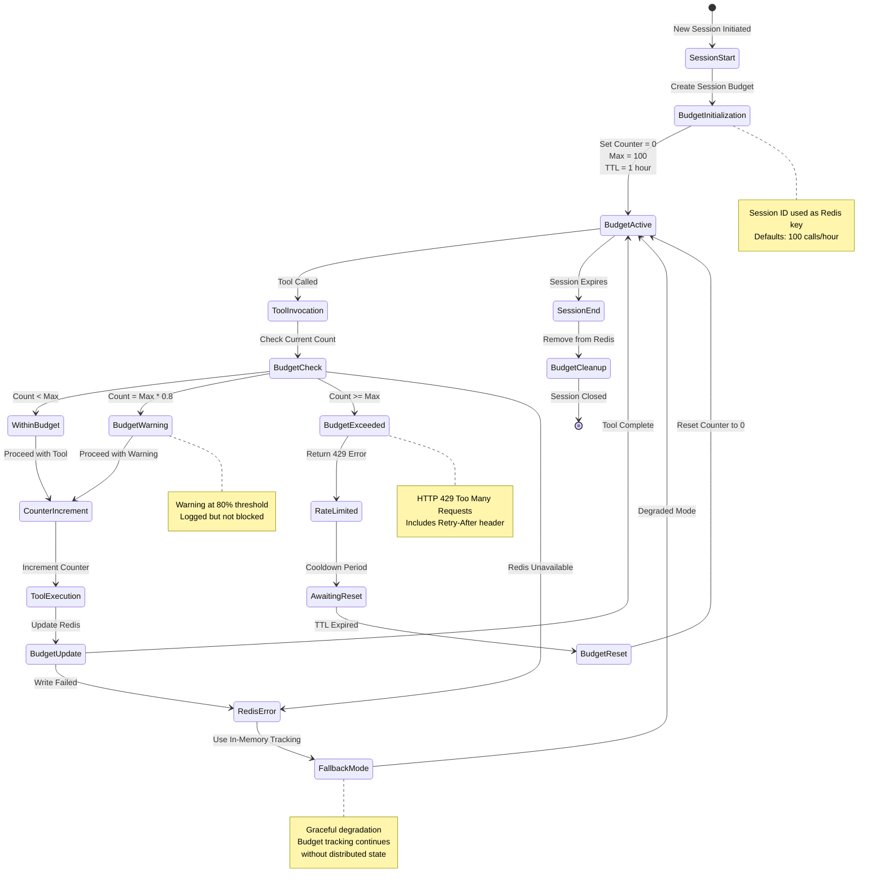

# State machine diagrams

## 1. Tool invocation lifecycle state machine

This diagram shows the complete lifecycle of an MCP tool invocation, from request to response, including all validation, security, and error handling states.

## 2. Resource compliance status state machine

This diagram shows the different states a resource can be in from a compliance perspective.

## 3. Cache state machine

This diagram shows the lifecycle of cached data in the Redis cache.

## 4. Budget tracking state machine

This diagram shows how the session budget is tracked and enforced.

## State transition summary

### Tool invocation states
1. **Request States**: RequestReceived, InputSanitization, SecurityValidation
2. **Validation States**: BudgetCheck, LoopDetection, SchemaValidation
3. **Execution States**: ToolExecution, ServiceCall, AWSAPICall
4. **Caching States**: CacheCheck, CacheHit, CacheMiss, CacheStorage
5. **Finalization States**: ResultFormatting, AuditLogging, ResponseSuccess
6. **Error States**: RequestError, SecurityBlocked, ValidationError, AWSError

### Compliance states
1. **Discovery**: Discovered, Scanning
2. **Evaluation**: PolicyEvaluation
3. **Compliance Levels**: FullyCompliant, PartiallyCompliant, NonCompliant, Untagged
4. **Remediation**: ViolationLogged, RemediationSuggested, AwaitingRemediation

### Cache states
1. **Lookup**: CacheQuery, KeyGeneration, CacheLookup
2. **Hit/Miss**: CacheHit, CacheMiss, TTLCheck
3. **Data Operations**: DataFetch, DataProcessing, CacheWrite
4. **Degradation**: CacheError, WriteError

### Budget states
1. **Active**: BudgetActive, WithinBudget
2. **Warning**: BudgetWarning
3. **Exceeded**: BudgetExceeded, RateLimited
4. **Recovery**: AwaitingReset, BudgetReset

## State machine properties

### Deterministic transitions
All state machines are deterministic - given the same input and current state, they always transition to the same next state.

### Error recovery
Each state machine includes error states with recovery paths, ensuring system resilience.

### Observability
All state transitions are logged to enable debugging and monitoring.

### Idempotency
Many operations (like compliance checks) are idempotent - repeated calls with same parameters produce same results.
