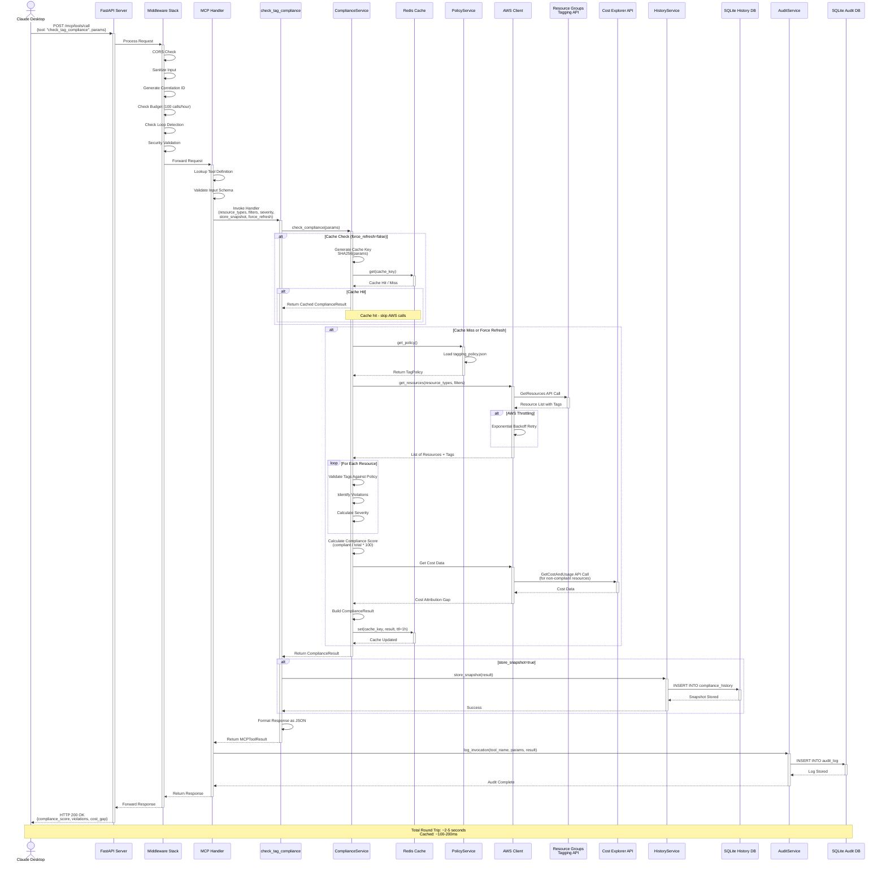
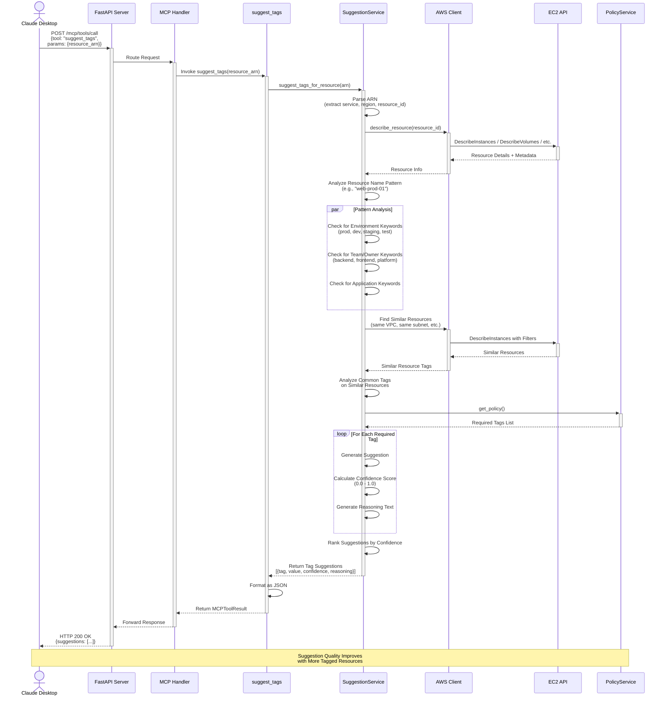
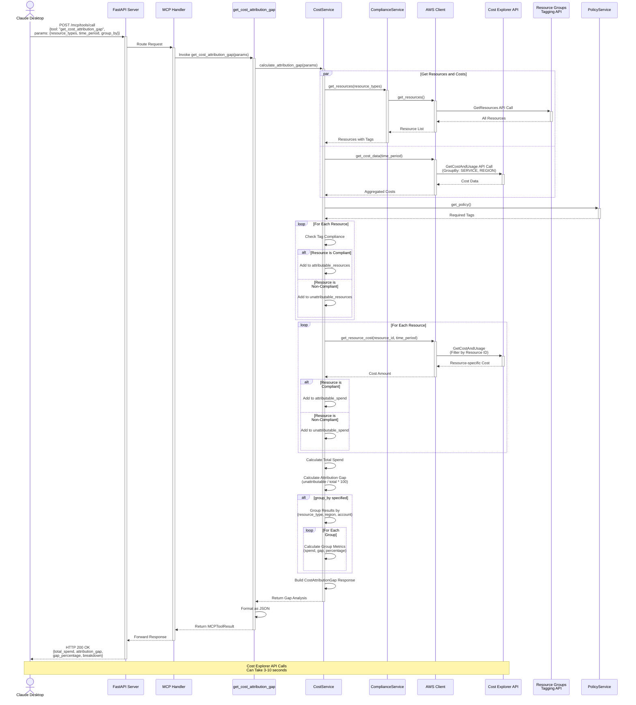
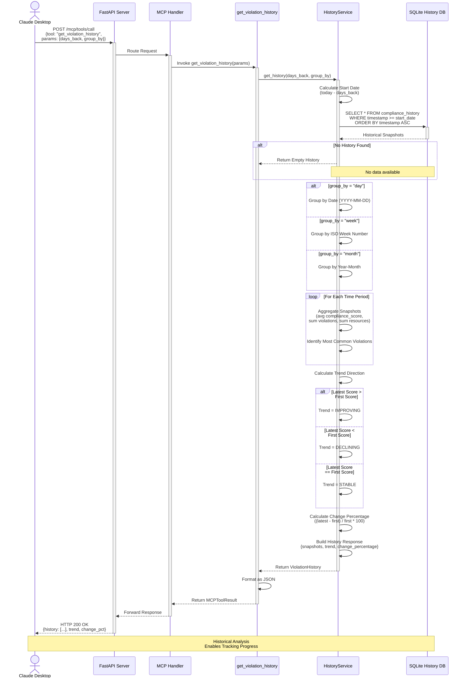

# Sequence diagrams

## 1. Full compliance check workflow

This sequence diagram shows the complete flow for a compliance check, including caching, AWS API calls, and history storage.



## 2. Tag suggestion workflow

This sequence diagram shows how the system generates intelligent tag suggestions for a resource.



## 3. Cost attribution gap analysis workflow

This sequence diagram shows how cost attribution gaps are calculated.



## 4. Violation history trend analysis workflow

This sequence diagram shows how historical compliance trends are retrieved and analyzed.



## 5. Error handling and retry flow

This sequence diagram shows how the system handles AWS API errors and implements retry logic.

```mermaid
sequenceDiagram
    actor User as Claude Desktop
    participant API as FastAPI Server
    participant Tool as Tool Handler
    participant CS as ComplianceService
    participant AWS as AWS Client
    participant API_AWS as AWS API

    User->>+API: Request Tool Invocation
    API->>+Tool: Invoke Tool
    Tool->>+CS: Execute Service Method
    CS->>+AWS: get_resources()

    AWS->>+API_AWS: API Call (Attempt 1)

    alt Success
        API_AWS-->>-AWS: 200 OK + Data
        AWS-->>CS: Return Resources
    else Throttling Error (429)
        API_AWS-->>AWS: 429 ThrottlingException
        AWS->>AWS: Wait 2s (Exponential Backoff)
        AWS->>+API_AWS: API Call (Attempt 2)

        alt Success
            API_AWS-->>-AWS: 200 OK + Data
            AWS-->>CS: Return Resources
        else Still Throttled
            API_AWS-->>AWS: 429 ThrottlingException
            AWS->>AWS: Wait 4s
            AWS->>+API_AWS: API Call (Attempt 3)

            alt Success
                API_AWS-->>-AWS: 200 OK + Data
                AWS-->>CS: Return Resources
            else Max Retries Exceeded
                API_AWS-->>AWS: 429 ThrottlingException
                AWS-->>-CS: Raise AWSThrottlingError
                CS-->>-Tool: Propagate Error
                Tool-->>-API: Return Error Response
                API-->>-User: HTTP 503 Service Unavailable<br/>{error: "AWS throttling", retry_after: 60}
            end
        end
    else Authorization Error (403)
        API_AWS-->>-AWS: 403 AccessDenied
        AWS-->>-CS: Raise AWSAuthError
        CS-->>-Tool: Propagate Error
        Tool->>Tool: Sanitize Error Message<br/>(remove credentials, paths)
        Tool-->>-API: Return Error Response
        API-->>-User: HTTP 500 Internal Server Error<br/>{error: "AWS access denied"}
    else Network Error
        API_AWS-->>-AWS: Network Timeout
        AWS->>AWS: Wait 2s
        AWS->>+API_AWS: API Call (Attempt 2)

        alt Success
            API_AWS-->>-AWS: 200 OK + Data
            AWS-->>CS: Return Resources
        else Still Failing
            API_AWS-->>-AWS: Network Timeout
            AWS-->>-CS: Raise NetworkError
            CS-->>-Tool: Propagate Error
            Tool-->>-API: Return Error Response
            API-->>-User: HTTP 504 Gateway Timeout
        end
    end

    Note over User,API_AWS: Retry Strategy:<br/>Exponential Backoff<br/>2s, 4s, 8s delays
```

## Key sequence flow insights

### 1. Compliance check flow
- **Duration**: 2-5 seconds (cache miss), 100-200ms (cache hit)
- **Bottlenecks**: AWS API calls, Cost Explorer queries
- **Optimization**: Redis caching reduces AWS API calls by ~80%

### 2. Tag suggestion flow
- **Duration**: 3-7 seconds
- **Complexity**: Analyzes resource metadata, naming patterns, and similar resources
- **Accuracy**: Improves as more resources become tagged

### 3. Cost attribution flow
- **Duration**: 3-10 seconds
- **Cost**: Expensive due to Cost Explorer API calls
- **Grouping**: Allows breakdown by resource type, region, or account

### 4. History flow
- **Duration**: 100-500ms
- **Data Source**: SQLite local database
- **Analysis**: Supports day/week/month grouping for trend analysis

### 5. Error handling flow
- **Retry Logic**: Exponential backoff (2s, 4s, 8s)
- **Max Retries**: 3 attempts
- **Error Sanitization**: Removes sensitive data from user-facing errors

## Timing summary

| Workflow | Average Duration | Cache Impact |
|----------|-----------------|--------------|
| Compliance Check | 2-5s | -90% (cached) |
| Tag Suggestions | 3-7s | N/A |
| Cost Attribution | 3-10s | -50% (partial cache) |
| History Analysis | 100-500ms | N/A |
| Policy Retrieval | 10-50ms | In-memory cache |

## Parallelization opportunities

Several operations can be parallelized:
1. **Resource scanning across regions** - Multiple AWS API calls in parallel
2. **Cost data retrieval** - Batch requests to Cost Explorer
3. **Similar resource analysis** - Multiple EC2 DescribeInstances calls
4. **Multi-tool invocations** - User can call multiple tools simultaneously
