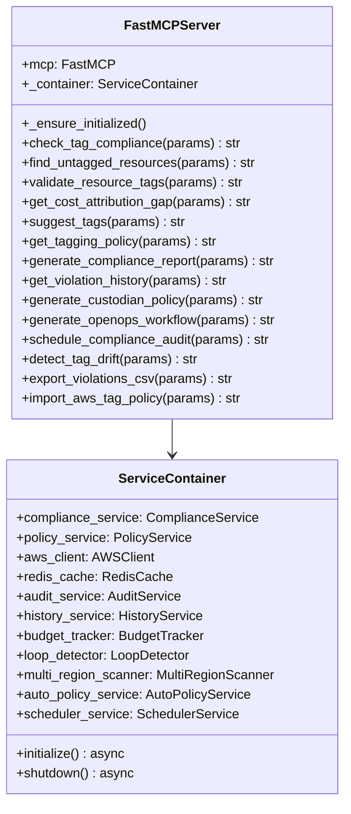
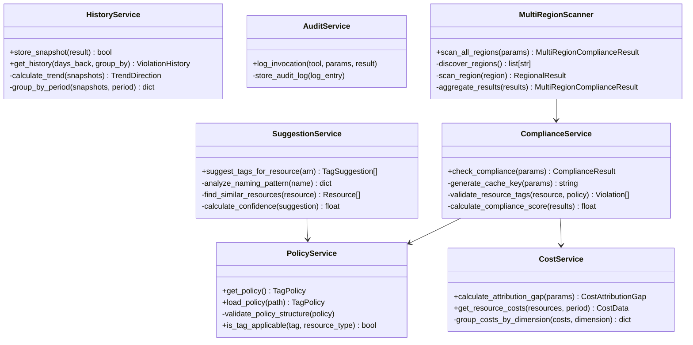
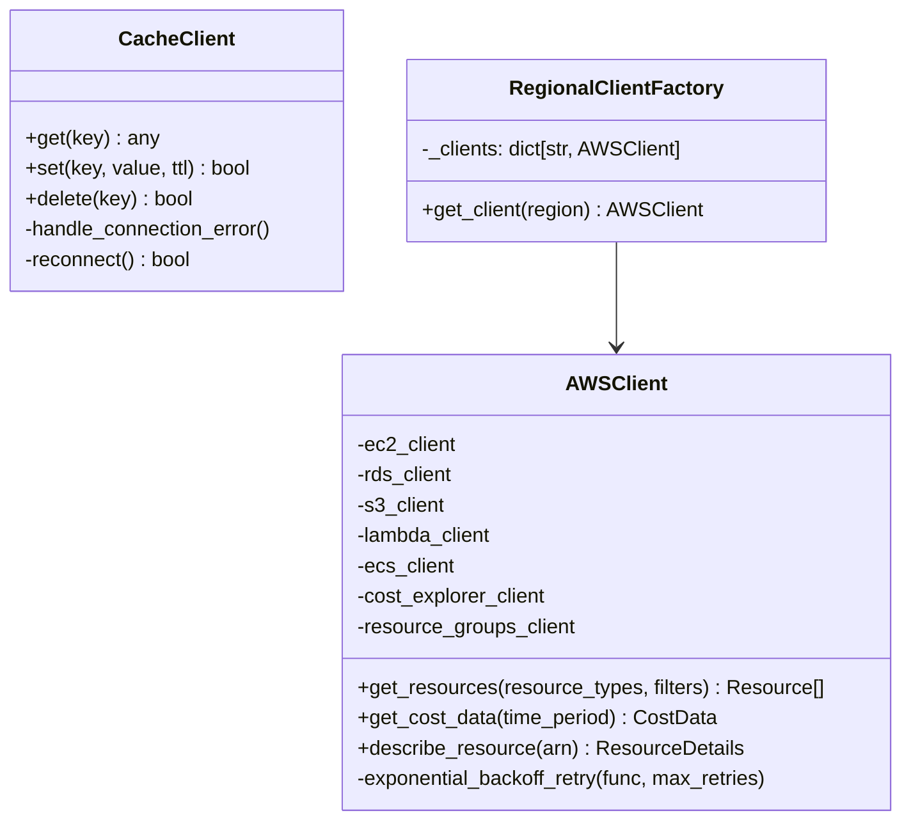
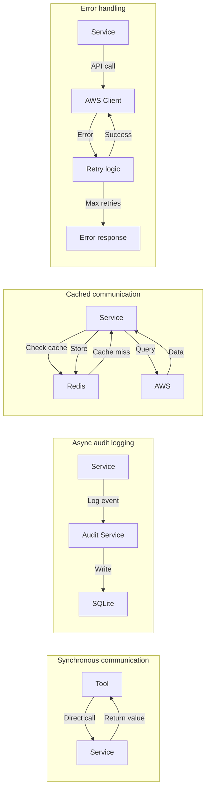
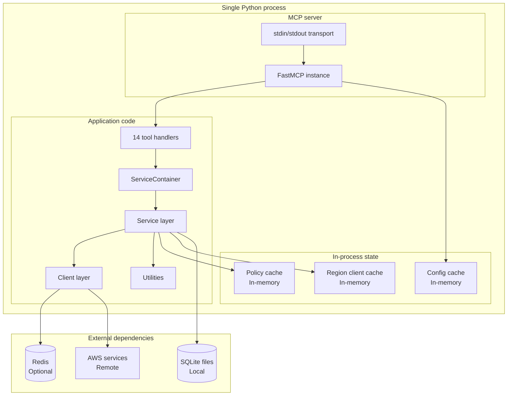
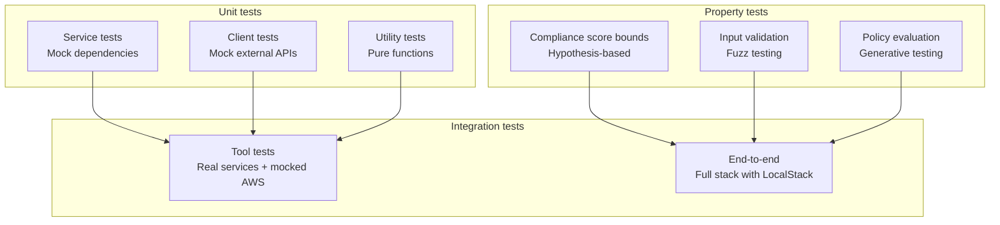

# Component diagram

## 1. High-level component architecture

This diagram shows the major logical components and their dependencies for the stdio MCP server.

```mermaid
graph TB
    subgraph "MCP transport layer"
        MCP[FastMCP stdio server<br/>Tool registry and JSON-RPC]
    end

    subgraph "Application layer — tools (14)"
        T1[check_tag_compliance]
        T2[find_untagged_resources]
        T3[validate_resource_tags]
        T4[get_cost_attribution_gap]
        T5[suggest_tags]
        T6[get_tagging_policy]
        T7[generate_compliance_report]
        T8[get_violation_history]
        T9[generate_custodian_policy]
        T10[generate_openops_workflow]
        T11[schedule_compliance_audit]
        T12[detect_tag_drift]
        T13[export_violations_csv]
        T14[import_aws_tag_policy]
    end

    subgraph "Business logic layer — ServiceContainer"
        CS[Compliance Service<br/>• Scan resources<br/>• Validate tags<br/>• Calculate scores]
        PS[Policy Service<br/>• Load policy<br/>• Validate structure<br/>• Check applicability]
        CostS[Cost Service<br/>• Query Cost Explorer<br/>• Calculate gaps<br/>• Group by dimensions]
        SS[Suggestion Service<br/>• Analyze patterns<br/>• Find similar resources<br/>• Generate suggestions]
        HS[History Service<br/>• Store snapshots<br/>• Query trends<br/>• Calculate changes]
        AS[Audit Service<br/>• Log invocations<br/>• Track parameters<br/>• Store results]
        APS[Auto Policy Service<br/>• Import from AWS Orgs<br/>• Detect policy source<br/>• Create defaults]
        SchedS[Scheduler Service<br/>• Recurring scans<br/>• Configurable schedule]
    end

    subgraph "Multi-region scanning"
        MRS[Multi-Region Scanner<br/>• Parallel region scanning<br/>• Result aggregation]
        RDS[Region Discovery Service<br/>• Query enabled regions<br/>• Cache region list]
        RCF[Regional Client Factory<br/>• Create per-region clients<br/>• Cache client instances]
    end

    subgraph "Guardrails"
        BT[Budget Tracker<br/>• 100 calls/session<br/>• In-memory or Redis]
        LD[Loop Detector<br/>• 3 identical calls/5 min<br/>• In-memory or Redis]
    end

    subgraph "Integration layer — clients"
        AWSC[AWS Client<br/>• EC2, RDS, S3, Lambda APIs<br/>• ECS, OpenSearch APIs<br/>• Cost Explorer API<br/>• Resource Groups API<br/>• Rate limiting<br/>• Exponential backoff]
        CacheC[Cache Client<br/>• Redis operations<br/>• TTL management<br/>• Graceful degradation]
    end

    subgraph "Data layer"
        Redis[(Redis<br/>• Compliance cache<br/>• Budget tracking<br/>• Loop detection<br/>Optional)]
        AuditDB[(SQLite — Audit<br/>• Tool invocations<br/>• Parameters<br/>• Results)]
        HistoryDB[(SQLite — History<br/>• Compliance snapshots<br/>• Timestamps<br/>• Scores)]
        PolicyFile[Policy config<br/>tagging_policy.json]
        ResourceTypesFile[Resource types config<br/>resource_types.json]
    end

    subgraph "External systems"
        AWS[AWS Services<br/>• EC2<br/>• RDS<br/>• S3<br/>• Lambda<br/>• ECS<br/>• OpenSearch]
        CE[Cost Explorer<br/>Always us-east-1]
        RGTA[Resource Groups<br/>Tagging API]
    end

    subgraph "Cross-cutting concerns"
        Utils[Utilities<br/>• Input validation<br/>• Error sanitization<br/>• Correlation IDs<br/>• ARN parsing]
        Config[Configuration<br/>• CoreSettings<br/>• Environment vars<br/>• Defaults]
    end

    %% MCP to Tools
    MCP --> T1
    MCP --> T2
    MCP --> T3
    MCP --> T4
    MCP --> T5
    MCP --> T6
    MCP --> T7
    MCP --> T8
    MCP --> T9
    MCP --> T10
    MCP --> T11
    MCP --> T12
    MCP --> T13
    MCP --> T14

    %% Guardrails
    MCP -.-> BT
    MCP -.-> LD

    %% Tools to Services
    T1 --> CS
    T2 --> CS
    T3 --> CS
    T4 --> CostS
    T5 --> SS
    T6 --> PS
    T7 --> CS
    T8 --> HS
    T9 --> PS
    T10 --> PS
    T11 --> PS
    T12 --> CS
    T13 --> CS
    T14 --> PS

    %% Tools to Multi-Region Scanner
    T1 --> MRS
    T2 --> MRS
    T7 --> MRS

    %% Service Dependencies
    CS --> PS
    CS --> CostS
    CS --> AWSC
    CS --> CacheC
    CostS --> AWSC
    SS --> AWSC
    SS --> PS
    HS --> HistoryDB
    AS --> AuditDB
    MRS --> RDS
    MRS --> RCF
    RCF --> AWSC
    RDS --> AWSC

    %% Client to External
    AWSC --> AWS
    AWSC --> CE
    AWSC --> RGTA
    CacheC --> Redis
    BT --> CacheC
    LD --> CacheC

    %% Services to Audit
    CS -.->|Log| AS
    CostS -.->|Log| AS
    SS -.->|Log| AS
    HS -.->|Log| AS

    %% Config Dependencies
    PS --> PolicyFile
    PS --> ResourceTypesFile
    AWSC --> Config
    CacheC --> Config

    %% Utils Dependencies
    MCP --> Utils
    CS --> Utils

    %% Styling
    classDef mcp fill:#e1f5ff,stroke:#01579b,stroke-width:2px
    classDef tools fill:#e8f5e9,stroke:#1b5e20,stroke-width:2px
    classDef services fill:#f3e5f5,stroke:#4a148c,stroke-width:2px
    classDef scanner fill:#e8eaf6,stroke:#283593,stroke-width:2px
    classDef guards fill:#fff8e1,stroke:#f9a825,stroke-width:2px
    classDef clients fill:#fff3e0,stroke:#e65100,stroke-width:2px
    classDef data fill:#fce4ec,stroke:#880e4f,stroke-width:2px
    classDef external fill:#fff9c4,stroke:#f57f17,stroke-width:2px
    classDef crosscut fill:#e0f2f1,stroke:#004d40,stroke-width:2px

    class MCP mcp
    class T1,T2,T3,T4,T5,T6,T7,T8,T9,T10,T11,T12,T13,T14 tools
    class CS,PS,CostS,SS,HS,AS,APS,SchedS services
    class MRS,RDS,RCF scanner
    class BT,LD guards
    class AWSC,CacheC clients
    class Redis,AuditDB,HistoryDB,PolicyFile,ResourceTypesFile data
    class AWS,CE,RGTA external
    class Utils,Config crosscut
```

## 2. Component dependency matrix

This table shows which components depend on each other.

| Component | Depends on | Used by |
|-----------|-----------|---------|
| **FastMCP stdio server** | Utils, Config | Claude Desktop, MCP Inspector |
| **Tools (14)** | Services, MCP server | MCP server |
| **Compliance Service** | Policy Service, Cost Service, AWS Client, Cache Client, Utils | Tools 1, 2, 3, 7, 12, 13 |
| **Policy Service** | Policy file, Resource types config | Compliance Service, Suggestion Service, Tools 6, 9, 10, 11, 14 |
| **Cost Service** | AWS Client, Utils | Compliance Service, Tool 4 |
| **Suggestion Service** | AWS Client, Policy Service | Tool 5 |
| **History Service** | History DB | Tool 8, Compliance Service |
| **Audit Service** | Audit DB | All services (logging) |
| **Multi-Region Scanner** | Region Discovery, Regional Client Factory | Tools 1, 2, 7 |
| **Region Discovery Service** | AWS Client (EC2), Cache Client | Multi-Region Scanner |
| **Regional Client Factory** | AWS Client constructor | Multi-Region Scanner |
| **Budget Tracker** | Cache Client (optional) | MCP server (pre-invocation) |
| **Loop Detector** | Cache Client (optional) | MCP server (pre-invocation) |
| **AWS Client** | AWS APIs, Config | All services that need AWS data |
| **Cache Client** | Redis (optional), Config | Compliance Service, Budget Tracker, Loop Detector |
| **Utilities** | — | All components |
| **Configuration** | Environment variables | All components |

## 3. Component interfaces

### MCP transport layer

### Service layer components

### Integration layer components

## 4. Component communication patterns

## 5. Component runtime structure

Components run as a single Python process:

## Component characteristics

### Stateless components
These components maintain no state between requests:
- FastMCP server (delegates to container)
- Tool handlers (pure adapters)
- Utility functions

### Stateful components
These components maintain state or cached data:
- ServiceContainer (holds all service references)
- Policy Service (in-memory policy cache)
- Configuration (loaded once at startup)
- Regional Client Factory (client connection pools)
- AWS Client (boto3 client initialization)

### Persistence components
These components interact with persistent storage:
- Audit Service → SQLite audit DB
- History Service → SQLite history DB
- Cache Client → Redis (optional)
- Policy Service → tagging_policy.json file

### External integration components
These components communicate with external systems:
- AWS Client → AWS APIs (EC2, RDS, S3, Lambda, ECS, OpenSearch, Cost Explorer, Resource Groups)

## Component testing strategy

## Component responsibilities summary

### Clear separation of concerns

1. **MCP transport layer**: stdio JSON-RPC protocol, tool registration
2. **Application layer**: Tool definitions, input validation, tool orchestration
3. **Business logic layer**: Domain logic, compliance checking, cost analysis
4. **Multi-region layer**: Region discovery, parallel scanning, result aggregation
5. **Integration layer**: External system communication, rate limiting, retries
6. **Data layer**: Persistence, caching, configuration

This architecture follows **Clean Architecture** principles with clear dependency rules:
- Dependencies point inward (transport → application → business logic → data)
- Inner layers have no knowledge of outer layers
- Business logic is independent of the transport protocol (stdio, HTTP, CLI, etc.)
