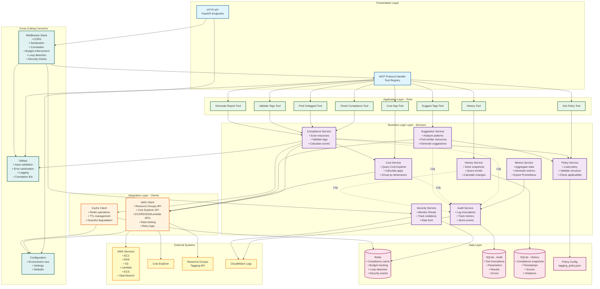
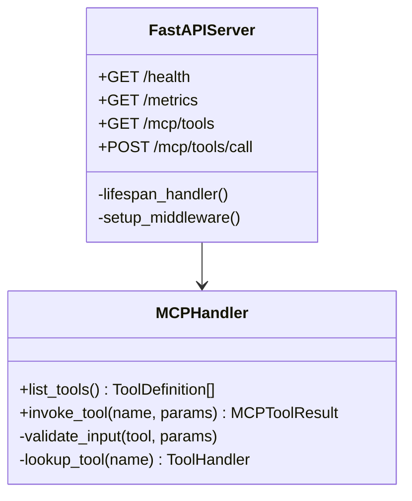
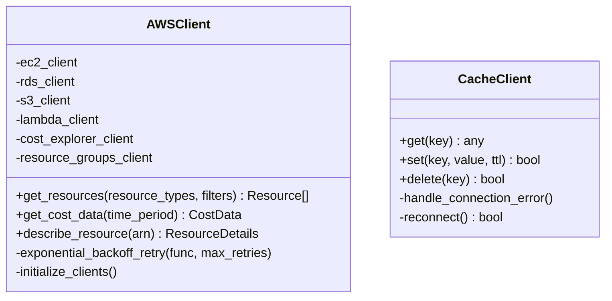
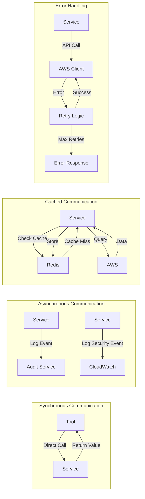
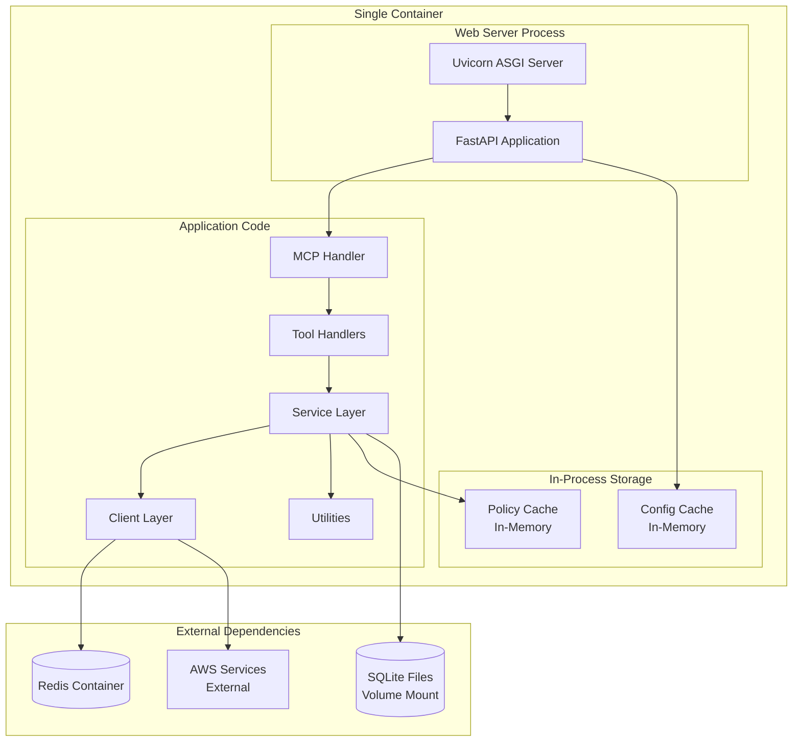
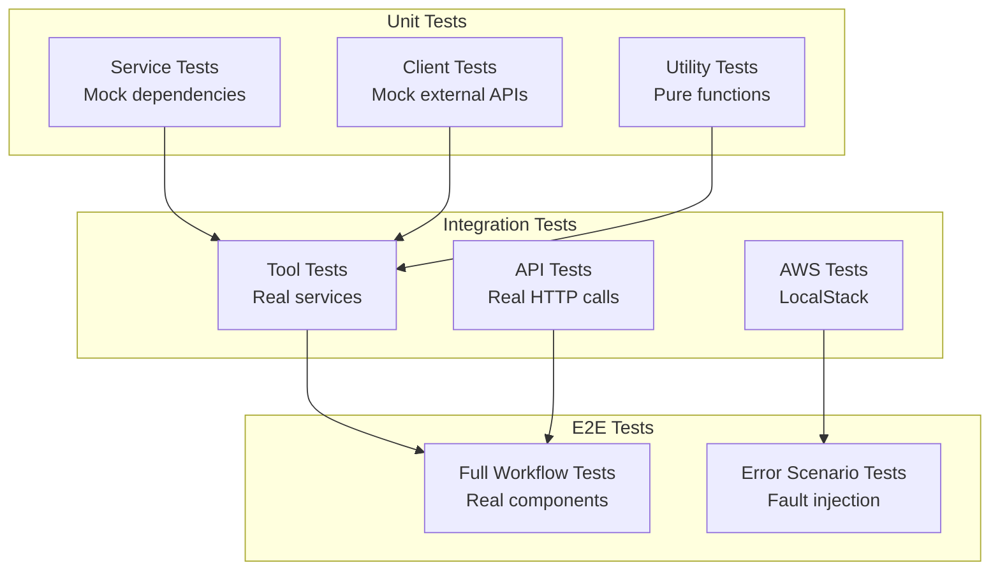

# Component Diagram

## 1. High-Level Component Architecture

This diagram shows the major logical components and their dependencies.

## 2. Component Dependency Matrix

This table shows which components depend on each other.

| Component | Depends On | Used By |
|-----------|-----------|---------|
| **HTTP API** | Middleware, Config | External Clients |
| **MCP Handler** | Utils, Middleware | HTTP API |
| **Tools (8)** | Services, MCP Handler | MCP Handler |
| **Compliance Service** | Policy Service, Cost Service, AWS Client, Cache Client, Utils | Tools 1, 2, 3, 7 |
| **Policy Service** | Policy File, Config | Compliance Service, Suggestion Service, Tools |
| **Cost Service** | AWS Client, Utils | Compliance Service, Tool 4 |
| **Suggestion Service** | AWS Client, Policy Service | Tool 5 |
| **History Service** | History DB | Tool 8, Compliance Service |
| **Audit Service** | Audit DB, CloudWatch | All Services (logging) |
| **Security Service** | Redis, CloudWatch | Middleware |
| **Metrics Service** | Audit Service | Monitoring Systems |
| **AWS Client** | AWS Services, Config | All Services that need AWS data |
| **Cache Client** | Redis, Config | Compliance Service, Security Service |
| **Middleware Stack** | Utils, Security Service, Config | HTTP API |
| **Utilities** | - | All Components |
| **Configuration** | Environment Variables | All Components |

## 3. Component Interfaces

### Presentation Layer Components

### Service Layer Components

```mermaid
classDiagram
    class ComplianceService {
        +check_compliance(params) ComplianceResult
        -generate_cache_key(params) string
        -validate_resource_tags(resource, policy) Violation[]
        -calculate_compliance_score(results) float
    }

    class PolicyService {
        +get_policy() TagPolicy
        +load_policy(path) TagPolicy
        -validate_policy_structure(policy)
        +is_tag_applicable(tag, resource_type) bool
    }

    class CostService {
        +calculate_attribution_gap(params) CostAttributionGap
        +get_resource_costs(resources, period) CostData
        -group_costs_by_dimension(costs, dimension) dict
    }

    class SuggestionService {
        +suggest_tags_for_resource(arn) TagSuggestion[]
        -analyze_naming_pattern(name) dict
        -find_similar_resources(resource) Resource[]
        -calculate_confidence(suggestion) float
    }

    class HistoryService {
        +store_snapshot(result) bool
        +get_history(days_back, group_by) ViolationHistory
        -calculate_trend(snapshots) TrendDirection
        -group_by_period(snapshots, period) dict
    }

    class AuditService {
        +log_invocation(tool, params, result)
        +get_metrics() Metrics
        -store_audit_log(log_entry)
    }

    class SecurityService {
        +check_security_threat(request) bool
        +log_security_event(event)
        +is_rate_limited(session) bool
    }

    class MetricsService {
        +generate_prometheus_metrics() string
        +get_tool_metrics() dict
        +get_error_rates() dict
    }

    ComplianceService --> PolicyService
    ComplianceService --> CostService
    SuggestionService --> PolicyService
```

### Integration Layer Components

## 4. Component Communication Patterns

## 5. Component Deployment Units

Components are grouped into deployment units:

## Component Characteristics

### Stateless Components
These components maintain no state between requests:
- FastAPI Server
- MCP Handler
- Tool Handlers
- Utility functions

### Stateful Components
These components maintain state or cached data:
- Policy Service (in-memory cache)
- Configuration (loaded once at startup)
- Redis Cache Client (connection pool)
- AWS Client (client initialization, connection pools)

### Persistence Components
These components interact with persistent storage:
- Audit Service → SQLite Audit DB
- History Service → SQLite History DB
- Cache Client → Redis
- Policy Service → tagging_policy.json file

### External Integration Components
These components communicate with external systems:
- AWS Client → AWS APIs
- CloudWatch Logger → CloudWatch Logs
- Metrics Service → Prometheus scraper

## Component Scalability Considerations

| Component | Scalability | Notes |
|-----------|-------------|-------|
| HTTP API | Horizontal | Stateless, load balancer ready |
| MCP Handler | Horizontal | No shared state |
| Tool Handlers | Horizontal | Independent execution |
| Services | Horizontal | Most are stateless |
| AWS Client | Vertical | Rate limited by AWS quotas |
| Redis Cache | Horizontal | Can use Redis Cluster |
| SQLite DBs | Vertical | Consider migration to managed DB for scale |
| Policy Service | Horizontal | In-memory cache, file system read |

## Component Testing Strategy

## Component Responsibilities Summary

### Clear Separation of Concerns

1. **Presentation Layer**: HTTP protocol, MCP protocol, request/response formatting
2. **Application Layer**: Tool definitions, input validation, tool orchestration
3. **Business Logic Layer**: Domain logic, compliance checking, cost analysis
4. **Integration Layer**: External system communication, rate limiting, retries
5. **Data Layer**: Persistence, caching, configuration
6. **Cross-Cutting**: Logging, monitoring, security, error handling

This architecture follows **Clean Architecture** principles with clear dependency rules:
- Dependencies point inward (presentation → application → business logic → data)
- Inner layers have no knowledge of outer layers
- Business logic is independent of frameworks and external systems
