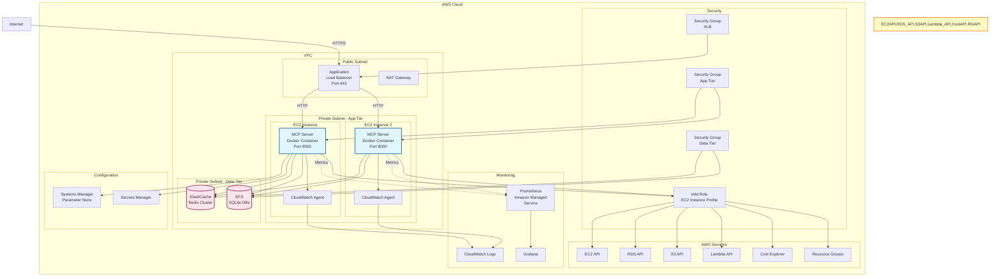
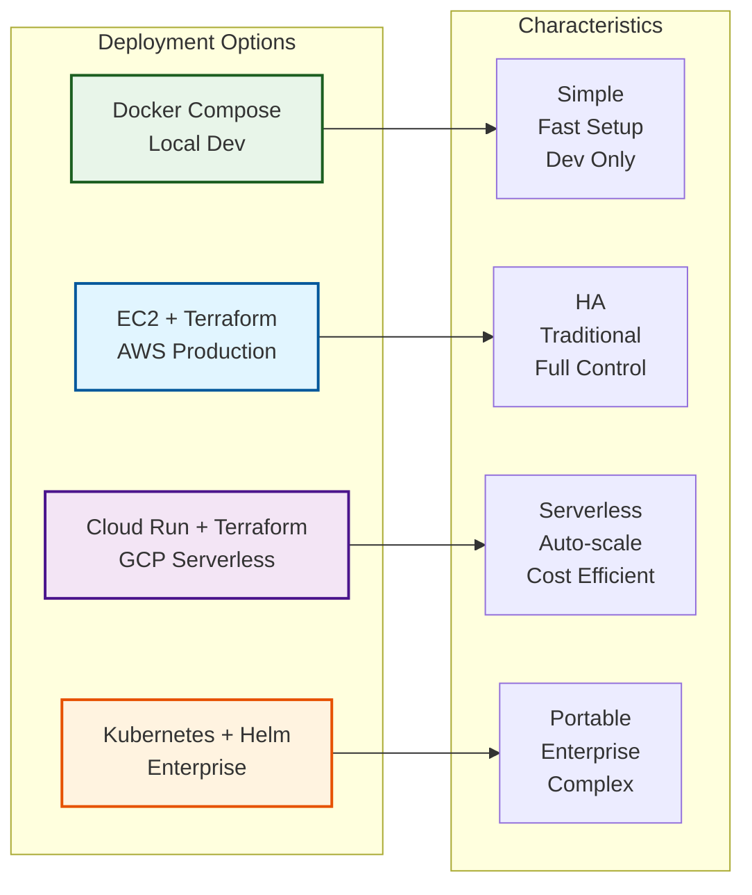
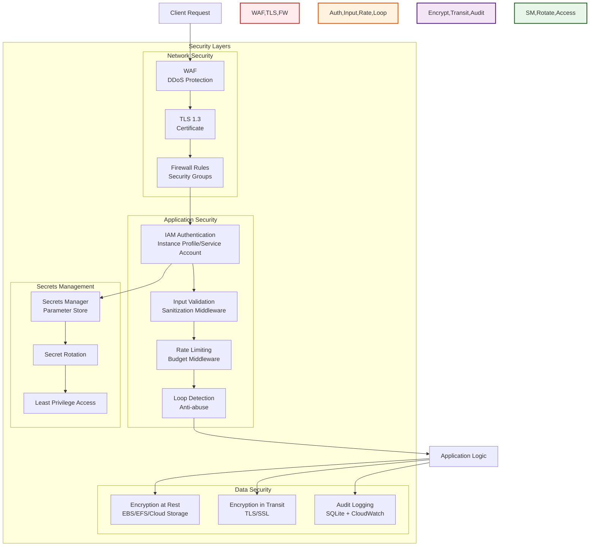
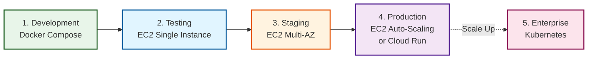

# Deployment Architecture Diagrams

## 1. Docker Compose Deployment (Development)

This is the recommended setup for local development and testing.

```mermaid
graph TB
    subgraph "Developer Machine"
        subgraph "Docker Network: mcp-network"
            subgraph "App Container"
                App[MCP Server<br/>FastAPI + Uvicorn<br/>Port 8000]
                AppVol[/app Volume Mount]
                DBVol[/data Volume Mount]
            end

            subgraph "Redis Container"
                Redis[(Redis<br/>Port 6379)]
                RedisVol[/data/redis Volume]
            end
        end

        subgraph "File System"
            Code[Source Code<br/>/mcp_server]
            Policy[Policy File<br/>/policies/tagging_policy.json]
            AuditDB[(audit.db)]
            HistoryDB[(history.db)]
            Logs[Log Files]
        end

        subgraph "AWS Credentials"
            Creds[~/.aws/credentials]
            Profile[AWS Profile]
        end
    end

    subgraph "AWS Cloud"
        EC2[EC2 API]
        RDS[RDS API]
        S3[S3 API]
        Lambda[Lambda API]
        Cost[Cost Explorer]
        RG[Resource Groups]
        IAM[IAM Auth]
    end

    Client[Claude Desktop] -->|HTTP:8000| App

    App --> Code
    App --> Policy
    App --> AuditDB
    App --> HistoryDB
    App --> Logs
    App --> Redis
    App --> Creds

    App -->|boto3| IAM
    IAM --> EC2
    IAM --> RDS
    IAM --> S3
    IAM --> Lambda
    IAM --> Cost
    IAM --> RG

    AppVol -.-> Code
    DBVol -.-> AuditDB
    DBVol -.-> HistoryDB
    RedisVol -.-> Redis

    style App fill:#e1f5ff,stroke:#01579b,stroke-width:2px
    style Redis fill:#fce4ec,stroke:#880e4f,stroke-width:2px
    style EC2,RDS,S3,Lambda,Cost,RG fill:#fff9c4,stroke:#f57f17,stroke-width:2px
```

**Docker Compose Configuration:**

```yaml
version: '3.8'

services:
  mcp-server:
    build: .
    ports:
      - "8000:8000"
    volumes:
      - ./mcp_server:/app/mcp_server
      - ./policies:/app/policies
      - ./data:/data
      - ~/.aws:/root/.aws:ro
    environment:
      - REDIS_URL=redis://redis:6379
      - AUDIT_DB_PATH=/data/audit.db
      - HISTORY_DB_PATH=/data/history.db
      - AWS_PROFILE=default
    depends_on:
      - redis
    networks:
      - mcp-network

  redis:
    image: redis:7-alpine
    ports:
      - "6379:6379"
    volumes:
      - redis-data:/data
    networks:
      - mcp-network

networks:
  mcp-network:
    driver: bridge

volumes:
  redis-data:
```

## 2. AWS EC2 Deployment (Production)

Production deployment on AWS EC2 with IAM instance profile for authentication.



**Deployment Characteristics:**

- **High Availability**: Multi-AZ deployment with ALB
- **Scalability**: Auto Scaling Group for EC2 instances
- **Security**: IAM instance profile, security groups, private subnets
- **Observability**: CloudWatch Logs, Prometheus metrics, Grafana dashboards
- **Data Persistence**: ElastiCache Redis for caching, EFS for SQLite databases
- **Configuration**: Parameter Store for config, Secrets Manager for secrets

## 3. Google Cloud Run Deployment (Serverless)

Serverless deployment on Google Cloud Run for auto-scaling and pay-per-use.

```mermaid
graph TB
    subgraph "Google Cloud"
        subgraph "Cloud Run Service"
            CR1[Container Instance 1<br/>MCP Server]
            CR2[Container Instance 2<br/>MCP Server]
            CR3[Container Instance N<br/>MCP Server]
        end

        subgraph "Data Services"
            Memorystore[(Cloud Memorystore<br/>Redis)]
            Filestore[(Cloud Filestore<br/>SQLite DBs)]
            Storage[(Cloud Storage<br/>Backups)]
        end

        subgraph "Networking"
            LB[Load Balancer<br/>Cloud Run URL]
            VPC[VPC Connector]
        end

        subgraph "Monitoring"
            Logging[Cloud Logging]
            Monitoring[Cloud Monitoring]
            Trace[Cloud Trace]
        end

        subgraph "Security"
            IAM_GCP[IAM Service Account]
            SecretMgr[Secret Manager]
        end

        subgraph "Cross-Cloud"
            Bridge[Cloud Interconnect<br/>or VPN]
        end
    end

    subgraph "AWS Cloud"
        EC2[EC2 API]
        RDS_AWS[RDS API]
        S3[S3 API]
        Lambda[Lambda API]
        Cost[Cost Explorer]
        RG[Resource Groups]
    end

    Client[Claude Desktop] -->|HTTPS| LB

    LB --> CR1
    LB --> CR2
    LB --> CR3

    CR1 --> VPC
    CR2 --> VPC
    CR3 --> VPC

    VPC --> Memorystore
    VPC --> Filestore

    CR1 --> Logging
    CR2 --> Logging
    CR3 --> Logging

    CR1 --> Monitoring
    CR1 --> Trace

    CR1 --> IAM_GCP
    CR1 --> SecretMgr

    CR1 --> Bridge
    Bridge --> EC2
    Bridge --> RDS_AWS
    Bridge --> S3
    Bridge --> Lambda
    Bridge --> Cost
    Bridge --> RG

    CR1 -.->|Backup| Storage
    Filestore -.->|Snapshot| Storage

    style CR1,CR2,CR3 fill:#e1f5ff,stroke:#01579b,stroke-width:2px
    style Memorystore,Filestore fill:#fce4ec,stroke:#880e4f,stroke-width:2px
    style EC2,RDS_AWS,S3,Lambda,Cost,RG fill:#fff9c4,stroke:#f57f17,stroke-width:2px
```

**Cloud Run Characteristics:**

- **Serverless**: Auto-scaling from 0 to N instances
- **Cost Efficient**: Pay per request, scale to zero
- **Multi-Cloud**: GCP compute, AWS data sources
- **Managed Services**: Memorystore, Filestore, Secret Manager
- **Observability**: Native GCP monitoring and logging

## 4. Kubernetes Deployment (Enterprise)

Enterprise-grade deployment on Kubernetes for maximum control and portability.

```mermaid
graph TB
    subgraph "Kubernetes Cluster"
        subgraph "Ingress"
            Ingress[Ingress Controller<br/>NGINX/Traefik]
            Cert[Cert Manager<br/>TLS Certificates]
        end

        subgraph "Namespace: mcp-prod"
            subgraph "Deployment: mcp-server"
                Pod1[Pod 1<br/>MCP Container]
                Pod2[Pod 2<br/>MCP Container]
                Pod3[Pod 3<br/>MCP Container]
            end

            Service[Service<br/>ClusterIP<br/>Port 8000]

            subgraph "StatefulSet: redis"
                Redis1[(Redis Primary)]
                Redis2[(Redis Replica)]
            end

            subgraph "PersistentVolumes"
                PVC1[PVC: audit-db]
                PVC2[PVC: history-db]
                PVC3[PVC: redis-data]
            end

            subgraph "ConfigMaps & Secrets"
                CM[ConfigMap<br/>Policy File]
                Secret[Secret<br/>AWS Credentials]
            end

            HPA[Horizontal Pod<br/>Autoscaler]
        end

        subgraph "Monitoring Stack"
            Prom[Prometheus<br/>Operator]
            Graf[Grafana]
            SM[ServiceMonitor<br/>MCP Server]
        end

        subgraph "Logging Stack"
            Fluentd[Fluentd DaemonSet]
            ES[Elasticsearch]
            Kibana[Kibana]
        end
    end

    subgraph "External"
        Client[Claude Desktop]
        AWS[AWS Services]
    end

    Client -->|HTTPS| Ingress
    Ingress --> Service
    Service --> Pod1
    Service --> Pod2
    Service --> Pod3

    Pod1 --> Redis1
    Pod2 --> Redis1
    Pod3 --> Redis1

    Redis1 --> Redis2

    Pod1 --> PVC1
    Pod1 --> PVC2
    Pod2 --> PVC1
    Pod2 --> PVC2

    Redis1 --> PVC3

    Pod1 --> CM
    Pod1 --> Secret

    HPA -.->|Scale| Pod3

    Pod1 -.->|Metrics| Prom
    SM --> Prom
    Prom --> Graf

    Pod1 -->|Logs| Fluentd
    Fluentd --> ES
    ES --> Kibana

    Pod1 --> AWS

    style Pod1,Pod2,Pod3 fill:#e1f5ff,stroke:#01579b,stroke-width:2px
    style Redis1,Redis2 fill:#fce4ec,stroke:#880e4f,stroke-width:2px
    style AWS fill:#fff9c4,stroke:#f57f17,stroke-width:2px
```

**Kubernetes Characteristics:**

- **High Availability**: Multiple pod replicas
- **Auto-Scaling**: HPA based on CPU/memory/custom metrics
- **Declarative Config**: GitOps-ready with YAML manifests
- **Observability**: Prometheus + Grafana + ELK stack
- **Persistence**: PersistentVolumeClaims for data
- **Security**: RBAC, NetworkPolicies, Pod Security Policies
- **Portability**: Can run on EKS, GKE, AKS, or on-prem

## 5. Infrastructure as Code Comparison



## 6. Security Architecture



## Deployment Decision Matrix

| Factor | Docker Compose | EC2 | Cloud Run | Kubernetes |
|--------|---------------|-----|-----------|------------|
| **Complexity** | ⭐ Very Low | ⭐⭐ Low | ⭐⭐ Low | ⭐⭐⭐⭐⭐ High |
| **Cost (Low Traffic)** | Free | $$$ | $ | $$$ |
| **Cost (High Traffic)** | N/A | $$$ | $$ | $$$ |
| **Scalability** | ❌ No | ⭐⭐ Manual | ⭐⭐⭐⭐⭐ Auto | ⭐⭐⭐⭐⭐ Auto |
| **High Availability** | ❌ No | ⭐⭐⭐ Manual | ⭐⭐⭐⭐ Built-in | ⭐⭐⭐⭐⭐ Built-in |
| **Maintenance** | Low | Medium | Low | High |
| **Portability** | ⭐⭐⭐ High | ⭐ Low | ⭐ Low | ⭐⭐⭐⭐⭐ Very High |
| **Best For** | Development | Production | Serverless | Enterprise |

## Recommended Deployment Path



## Resource Requirements

### Development (Docker Compose)
- **CPU**: 2 cores
- **Memory**: 4 GB RAM
- **Storage**: 10 GB
- **Network**: Broadband internet

### Production (EC2)
- **Instance Type**: t3.medium (2 vCPU, 4 GB RAM)
- **Storage**: 20 GB EBS gp3
- **ElastiCache**: cache.t3.micro (0.5 GB RAM)
- **EFS**: 10 GB (general purpose)

### Production (Cloud Run)
- **CPU**: 1 vCPU per instance
- **Memory**: 2 GB per instance
- **Max Instances**: 10 (configurable)
- **Memorystore**: 1 GB Redis instance

### Enterprise (Kubernetes)
- **Nodes**: 3+ nodes (t3.medium or equivalent)
- **Pods**: 3-10 replicas
- **Redis**: StatefulSet with 1 primary + 1 replica
- **Storage**: 50 GB PVC for databases
