# Production CloudFormation Architecture

This diagram shows the architecture deployed by `infrastructure/cloudformation-production.yaml`.

## Architecture Overview

```mermaid
graph TB
    subgraph "External"
        Users[("👤 Claude.ai Users")]
        Internet((Internet))
    end

    subgraph "AWS Cloud"
        subgraph "Security & Certificates"
            ACM[🔐 ACM Certificate<br/>*.optimnow.io]
        end

        subgraph "VPC (10.0.0.0/16)"
            subgraph "Public Subnets"
                subgraph "AZ-a (10.0.1.0/24)"
                    IGW[🌐 Internet Gateway]
                    NAT[📤 NAT Gateway]
                end
                subgraph "AZ-b (10.0.2.0/24)"
                    ALB[⚖️ Application Load Balancer<br/>HTTPS:443<br/>TLS 1.3]
                end
            end

            subgraph "Private Subnets"
                subgraph "AZ-a (10.0.10.0/24)"
                    EC2[🖥️ EC2 Instance<br/>t3.medium<br/>MCP Server :8080]
                end
                subgraph "AZ-b (10.0.11.0/24)"
                    subgraph "VPC Endpoints"
                        VPCE_EC2[EC2 Endpoint]
                        VPCE_Logs[CloudWatch Logs Endpoint]
                        VPCE_Secrets[Secrets Manager Endpoint]
                        VPCE_S3[S3 Gateway Endpoint]
                    end
                end
            end
        end

        subgraph "Security & IAM"
            SecretsManager[🔑 Secrets Manager<br/>API Keys]
            IAMRole[👤 IAM Role<br/>Instance Profile]
        end

        subgraph "Monitoring & Alerting"
            CloudWatch[📊 CloudWatch Logs<br/>/mcp-tagging/prod]
            Alarms[🚨 CloudWatch Alarms<br/>Auth Failures<br/>CORS Violations<br/>5xx Errors]
            SNS[📧 SNS Topic<br/>Security Alerts]
        end

        subgraph "AWS Services (Read-Only Access)"
            EC2_API[EC2 API]
            RDS_API[RDS API]
            S3_API[S3 API]
            Lambda_API[Lambda API]
            ECS_API[ECS API]
            CostExplorer[Cost Explorer API]
            TagAPI[Resource Groups Tagging API]
        end
    end

    %% Traffic Flow
    Users -->|HTTPS| Internet
    Internet -->|HTTPS| IGW
    IGW --> ALB
    ACM -.->|TLS Certificate| ALB
    ALB -->|HTTP :8080| EC2
    EC2 -->|Outbound| NAT
    NAT --> IGW

    %% VPC Endpoints
    EC2 --> VPCE_EC2
    EC2 --> VPCE_Logs
    EC2 --> VPCE_Secrets
    EC2 --> VPCE_S3

    %% Security
    EC2 --> IAMRole
    EC2 --> SecretsManager

    %% Monitoring
    EC2 -->|Logs| CloudWatch
    Alarms -->|Alerts| SNS

    %% AWS API Access
    IAMRole --> EC2_API
    IAMRole --> RDS_API
    IAMRole --> S3_API
    IAMRole --> Lambda_API
    IAMRole --> ECS_API
    IAMRole --> CostExplorer
    IAMRole --> TagAPI

    %% Styling
    style ALB fill:#ff9900,stroke:#232f3e,color:#fff
    style EC2 fill:#ff9900,stroke:#232f3e,color:#fff
    style ACM fill:#dd344c,stroke:#232f3e,color:#fff
    style SecretsManager fill:#dd344c,stroke:#232f3e,color:#fff
    style IAMRole fill:#dd344c,stroke:#232f3e,color:#fff
    style CloudWatch fill:#ff4f8b,stroke:#232f3e,color:#fff
    style SNS fill:#ff4f8b,stroke:#232f3e,color:#fff
```



## Security Features

| Feature | Implementation | Requirement |
|---------|---------------|-------------|
| **TLS Termination** | ALB with ACM certificate, TLS 1.3 | 18.3 |
| **Private EC2** | EC2 in private subnet, no public IP | 21.1 |
| **Network Isolation** | Security groups: ALB→EC2 only on :8080 | 21.3 |
| **VPC Endpoints** | Private access to AWS APIs | 21.4 |
| **API Key Auth** | Secrets Manager for API keys | 19.6 |
| **Security Monitoring** | CloudWatch alarms + SNS alerts | 23.2, 23.5 |

## Network Flow

```
┌─────────────┐     ┌─────────────┐     ┌─────────────┐     ┌─────────────┐
│   Claude    │────▶│   Internet  │────▶│     ALB     │────▶│  EC2 (MCP)  │
│   Users     │     │   Gateway   │     │  HTTPS:443  │     │  HTTP:8080  │
└─────────────┘     └─────────────┘     └─────────────┘     └─────────────┘
                                              │                    │
                                              │                    │
                                        ┌─────┴─────┐        ┌─────┴─────┐
                                        │    ACM    │        │    VPC    │
                                        │Certificate│        │ Endpoints │
                                        └───────────┘        └───────────┘
```

## Security Groups

### ALB Security Group
- **Inbound**: HTTPS (443) from 0.0.0.0/0
- **Outbound**: HTTP (8080) to MCP Server SG only

### MCP Server Security Group
- **Inbound**: HTTP (8080) from ALB SG only
- **Outbound**: HTTPS (443) to 0.0.0.0/0 (for AWS APIs)

### VPC Endpoint Security Group
- **Inbound**: HTTPS (443) from MCP Server SG only

## CloudWatch Alarms

| Alarm | Metric | Threshold | Action |
|-------|--------|-----------|--------|
| Auth Failures | AuthenticationFailures | >10 in 5 min | SNS Alert |
| CORS Violations | CORSViolations | >20 in 5 min | SNS Alert |
| ALB 5xx Errors | HTTPCode_ELB_5XX_Count | >10 in 5 min | SNS Alert |

## Cost Estimate

| Resource | Monthly Cost (us-east-1) |
|----------|-------------------------|
| t3.medium EC2 | ~$30 |
| NAT Gateway | ~$32 + data |
| ALB | ~$16 + data |
| VPC Endpoints (4x Interface) | ~$29 |
| CloudWatch Logs | ~$1-5 |
| Secrets Manager | ~$0.40 |
| **Total** | **~$110-120/month** |

> **Note**: Production architecture costs more than basic deployment due to NAT Gateway, ALB, and VPC Endpoints. These are required for security compliance.

## Deployment Parameters

| Parameter | Description | Example |
|-----------|-------------|---------|
| `ProjectName` | Resource naming prefix | `mcp-tagging` |
| `Environment` | Environment name | `prod` |
| `KeyPairName` | EC2 SSH key pair | `mcp-server-key-new` |
| `ACMCertificateArn` | ACM certificate ARN | `arn:aws:acm:...` |
| `AlertEmail` | Security alert email | `alerts@example.com` |
| `CORSAllowedOrigins` | Allowed CORS origins | `https://claude.ai` |

## Outputs

| Output | Description |
|--------|-------------|
| `LoadBalancerDNS` | ALB DNS name for CNAME record |
| `MCPServerEndpoint` | Full HTTPS endpoint URL |
| `APIKeySecretArn` | Secrets Manager ARN for API keys |
| `InstanceId` | EC2 instance ID for SSM access |
