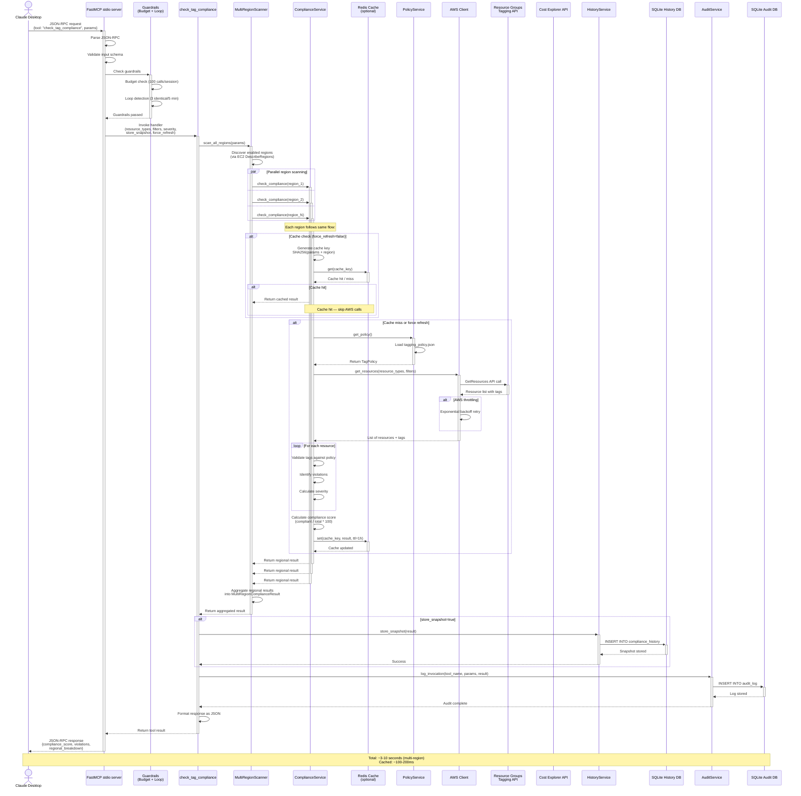
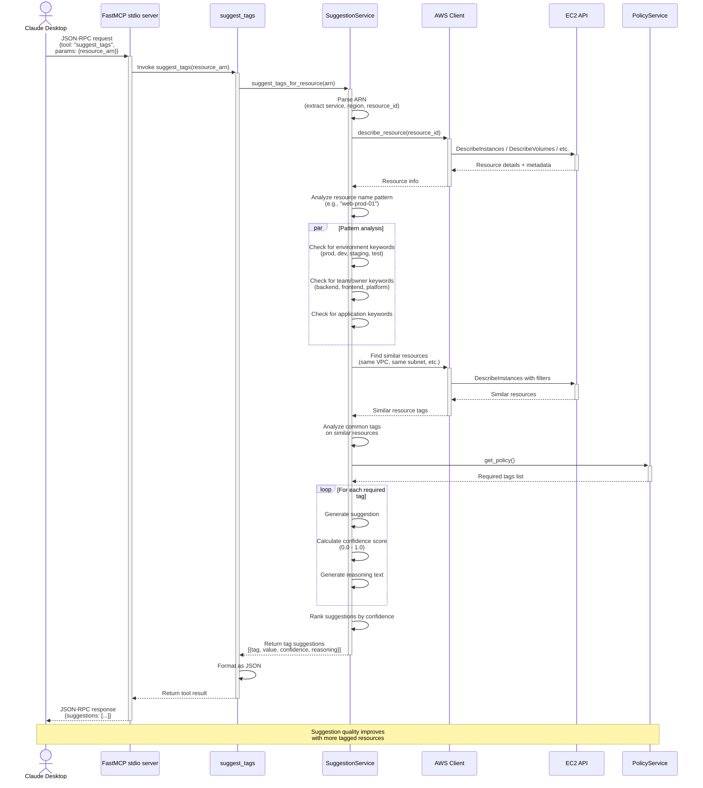
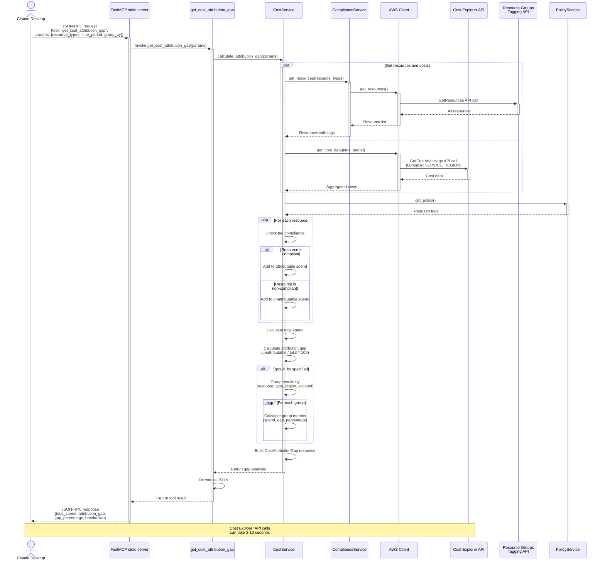
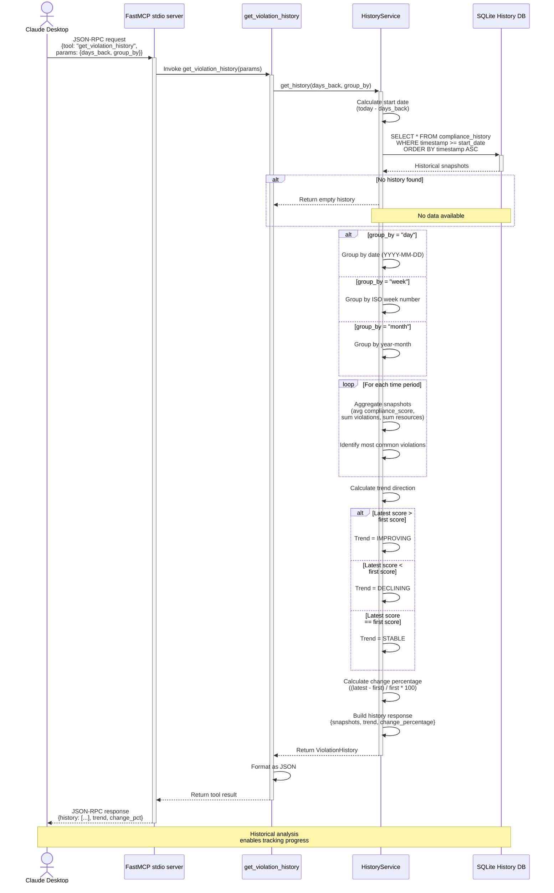

# Sequence diagrams

## 1. Full compliance check workflow

This sequence diagram shows the complete flow for a compliance check via stdio, including multi-region scanning, caching, AWS API calls, and history storage.



## 2. Tag suggestion workflow

This sequence diagram shows how the system generates intelligent tag suggestions for a resource.



## 3. Cost attribution gap analysis workflow

This sequence diagram shows how cost attribution gaps are calculated.



## 4. Violation history trend analysis workflow

This sequence diagram shows how historical compliance trends are retrieved and analyzed.



## 5. Error handling and retry flow

This sequence diagram shows how the system handles AWS API errors and implements retry logic.

```mermaid
sequenceDiagram
    actor User as Claude Desktop
    participant MCP as FastMCP stdio server
    participant Tool as Tool handler
    participant CS as ComplianceService
    participant AWS as AWS Client
    participant API_AWS as AWS API

    User->>+MCP: JSON-RPC request
    MCP->>+Tool: Invoke tool
    Tool->>+CS: Execute service method
    CS->>+AWS: get_resources()

    AWS->>+API_AWS: API call (attempt 1)

    alt Success
        API_AWS-->>-AWS: 200 OK + data
        AWS-->>CS: Return resources
    else Throttling error (429)
        API_AWS-->>AWS: ThrottlingException
        AWS->>AWS: Wait 2s (exponential backoff)
        AWS->>+API_AWS: API call (attempt 2)

        alt Success
            API_AWS-->>-AWS: 200 OK + data
            AWS-->>CS: Return resources
        else Still throttled
            API_AWS-->>AWS: ThrottlingException
            AWS->>AWS: Wait 4s
            AWS->>+API_AWS: API call (attempt 3)

            alt Success
                API_AWS-->>-AWS: 200 OK + data
                AWS-->>CS: Return resources
            else Max retries exceeded
                API_AWS-->>AWS: ThrottlingException
                AWS-->>-CS: Raise AWSThrottlingError
                CS-->>-Tool: Propagate error
                Tool->>Tool: Sanitize error message<br/>(remove credentials, paths)
                Tool-->>-MCP: Return error result
                MCP-->>-User: JSON-RPC error response<br/>{error: "AWS rate limit exceeded"}
            end
        end
    else Authorization error (403)
        API_AWS-->>-AWS: AccessDenied
        AWS-->>-CS: Raise AWSAuthError
        CS-->>-Tool: Propagate error
        Tool->>Tool: Sanitize error message
        Tool-->>-MCP: Return error result
        MCP-->>-User: JSON-RPC error response<br/>{error: "AWS access denied"}
    else Network error
        API_AWS-->>-AWS: Network timeout
        AWS->>AWS: Wait 2s
        AWS->>+API_AWS: API call (attempt 2)

        alt Success
            API_AWS-->>-AWS: 200 OK + data
            AWS-->>CS: Return resources
        else Still failing
            API_AWS-->>-AWS: Network timeout
            AWS-->>-CS: Raise NetworkError
            CS-->>-Tool: Propagate error
            Tool-->>-MCP: Return error result
            MCP-->>-User: JSON-RPC error response<br/>{error: "AWS connection failed"}
        end
    end

    Note over User,API_AWS: Retry strategy:<br/>Exponential backoff<br/>2s, 4s, 8s delays
```

## Key sequence flow insights

### 1. Compliance check flow
- **Duration**: 3-10 seconds (multi-region, cache miss), 100-200ms (cache hit)
- **Bottlenecks**: AWS API calls, Cost Explorer queries, number of regions
- **Optimization**: Redis caching reduces AWS API calls by ~80%

### 2. Tag suggestion flow
- **Duration**: 3-7 seconds
- **Complexity**: Analyzes resource metadata, naming patterns, and similar resources
- **Accuracy**: Improves as more resources become tagged

### 3. Cost attribution flow
- **Duration**: 3-10 seconds
- **Cost**: Expensive due to Cost Explorer API calls
- **Grouping**: Allows breakdown by resource type, region, or account

### 4. History flow
- **Duration**: 100-500ms
- **Data source**: SQLite local database
- **Analysis**: Supports day/week/month grouping for trend analysis

### 5. Error handling flow
- **Retry logic**: Exponential backoff (2s, 4s, 8s)
- **Max retries**: 3 attempts
- **Error sanitization**: Removes sensitive data from user-facing errors

## Timing summary

| Workflow | Average duration | Cache impact |
|----------|-----------------|--------------|
| Compliance check (multi-region) | 3-10s | -90% (cached) |
| Compliance check (single region) | 2-5s | -90% (cached) |
| Tag suggestions | 3-7s | N/A |
| Cost attribution | 3-10s | -50% (partial cache) |
| History analysis | 100-500ms | N/A |
| Policy retrieval | 10-50ms | In-memory cache |

## Parallelization opportunities

Several operations can be parallelized:
1. **Multi-region scanning** — Compliance checks run in parallel across regions (default: 5 concurrent)
2. **Resource and cost data retrieval** — Fetched in parallel during cost attribution
3. **Similar resource analysis** — Multiple DescribeInstances calls for tag suggestions
